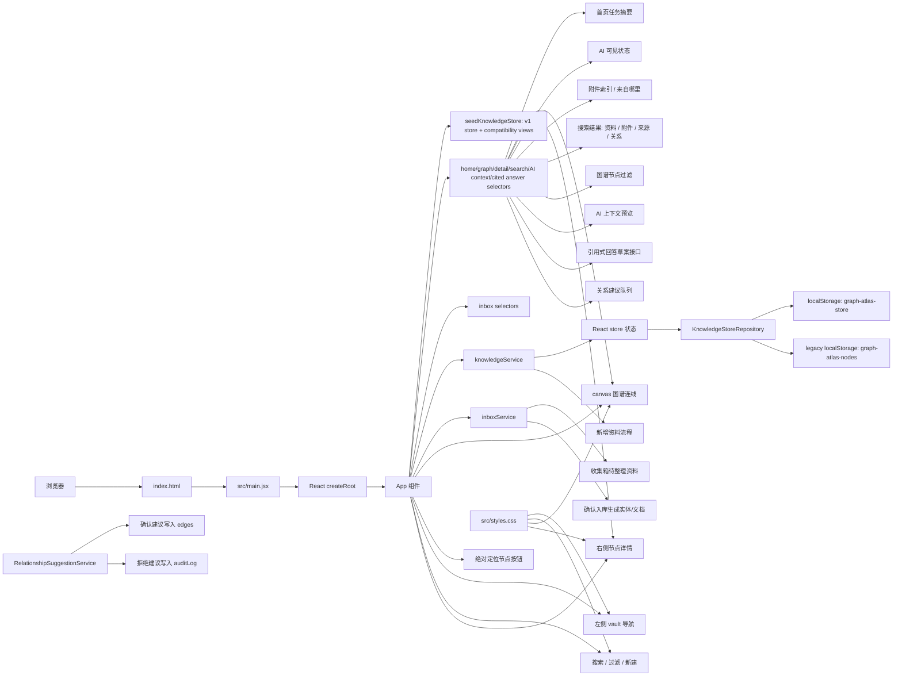
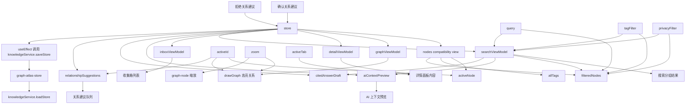
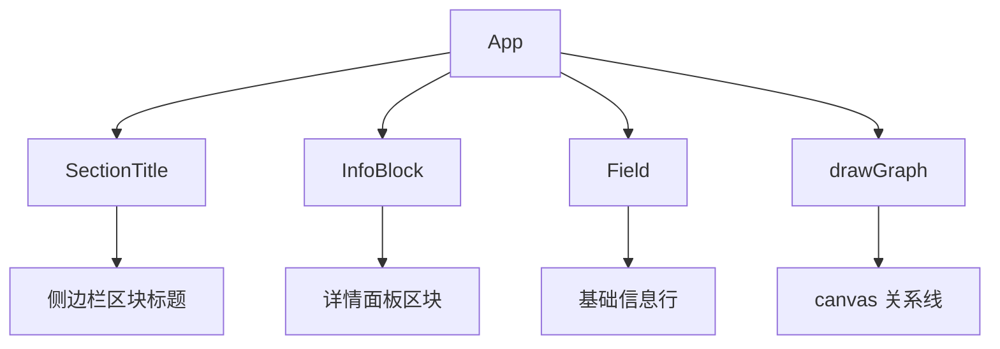
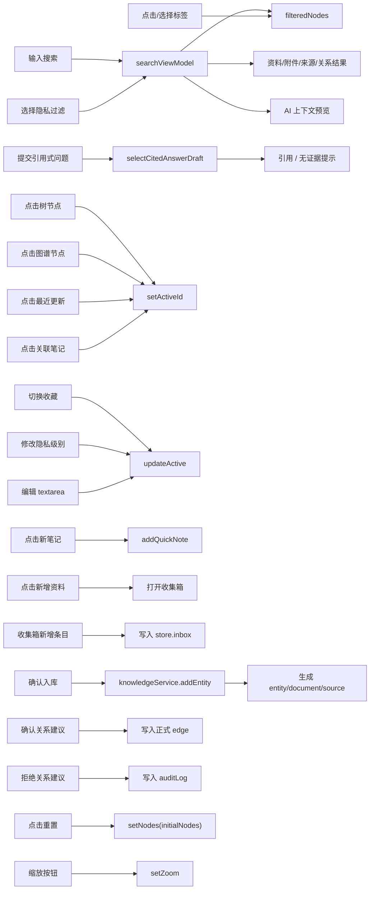
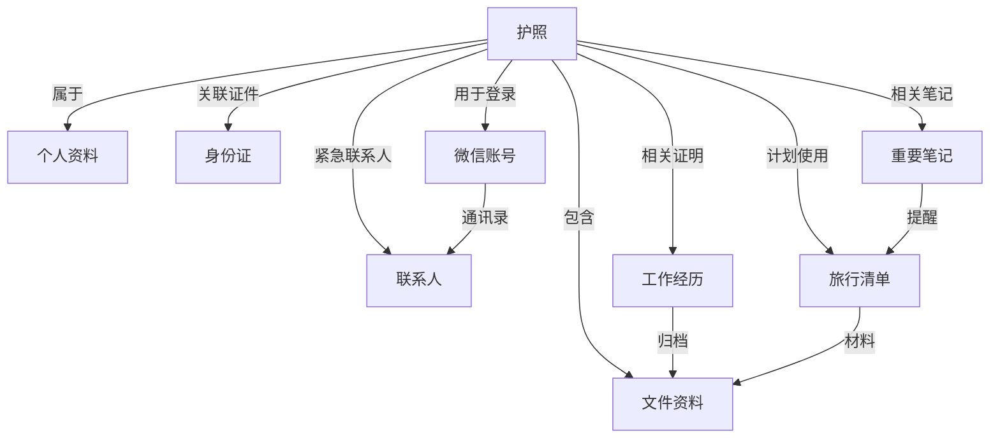

# 项目知识图谱

## 1. 项目概览

Graph Atlas 是一个基于 Vite + React 的单页原型应用，用来展示本地个人资料库 / 知识图谱界面。

- 项目目录：`graph-atlas/`
- 运行形态：浏览器 SPA
- 前端框架：React 19.2.0
- 构建工具：Vite 6.4.2，使用 `@vitejs/plugin-react`
- 依赖基线：`graph-atlas/package-lock.json`
- 数据来源：`src/data/seedKnowledgeStore.js` 中的 v1 knowledge store seed data
- 本地持久化：通过 `knowledgeService` / `KnowledgeStoreRepository` / storage helper 写入 `localStorage`，键名为 `graph-atlas-store`
- 已生成输出：`outputs/*.html`

## 2. 文件图谱

```mermaid
graph TD
  Root["repository root"] --> AppDir["graph-atlas/"]
  Root --> Outputs["outputs/"]
  AppDir --> Pkg["package.json"]
  AppDir --> Lock["package-lock.json"]
  AppDir --> Vite["vite.config.mjs"]
  AppDir --> Html["index.html"]
  AppDir --> Agents["AGENTS.md"]
  AppDir --> QA["design-qa.md"]
  AppDir --> Src["src/"]
  Src --> Main["main.jsx"]
  Src --> App["App.jsx"]
  Src --> DataDir["data/"]
  DataDir --> Seed["seedKnowledgeStore.js"]
  DataDir --> Schema["schema.js"]
  DataDir --> SeedTest["seedKnowledgeStore.test.js"]
  Src --> DomainDir["domain/"]
  DomainDir --> Relationships["relationships.js"]
  DomainDir --> Privacy["privacy.js"]
  DomainDir --> PrivacyTest["privacy.test.js"]
  DomainDir --> MaterialStatus["materialStatus.js"]
  DomainDir --> MaterialStatusTest["materialStatus.test.js"]
  Src --> SelectorsDir["selectors/"]
  SelectorsDir --> GraphSelectors["graphSelectors.js"]
  SelectorsDir --> DetailSelectors["detailSelectors.js"]
  SelectorsDir --> HomeSelectors["homeSelectors.js"]
  SelectorsDir --> InboxSelectors["inboxSelectors.js"]
  SelectorsDir --> InboxSelectorsTest["inboxSelectors.test.js"]
  SelectorsDir --> SearchSelectors["searchSelectors.js"]
  SelectorsDir --> SearchSelectorsTest["searchSelectors.test.js"]
  SelectorsDir --> AiContextSelectors["aiContextSelectors.js"]
  SelectorsDir --> AiContextSelectorsTest["aiContextSelectors.test.js"]
  SelectorsDir --> CitedAnswerSelectors["citedAnswerSelectors.js"]
  SelectorsDir --> CitedAnswerSelectorsTest["citedAnswerSelectors.test.js"]
  SelectorsDir --> RelationshipSuggestionSelectors["relationshipSuggestionSelectors.js"]
  SelectorsDir --> RelationshipSuggestionSelectorsTest["relationshipSuggestionSelectors.test.js"]
  Src --> StorageDir["storage/"]
  StorageDir --> StoreStorage["knowledgeStoreStorage.js"]
  StorageDir --> Migrations["migrations.js"]
  Src --> RepoDir["repositories/"]
  RepoDir --> StoreRepo["knowledgeStoreRepository.js"]
  RepoDir --> StoreRepoTest["knowledgeStoreRepository.test.js"]
  Src --> ServiceDir["services/"]
  ServiceDir --> KnowledgeService["knowledgeService.js"]
  ServiceDir --> KnowledgeServiceTest["knowledgeService.test.js"]
  ServiceDir --> InboxService["inboxService.js"]
  ServiceDir --> InboxServiceTest["inboxService.test.js"]
  ServiceDir --> RelationshipSuggestionService["relationshipSuggestionService.js"]
  ServiceDir --> RelationshipSuggestionServiceTest["relationshipSuggestionService.test.js"]
  Src --> CSS["styles.css"]
  Html --> Main
  Main --> App
  Main --> CSS
  App --> Seed
  App --> GraphSelectors
  App --> DetailSelectors
  App --> HomeSelectors
  App --> InboxSelectors
  App --> SearchSelectors
  App --> AiContextSelectors
  App --> CitedAnswerSelectors
  App --> RelationshipSuggestionSelectors
  App --> KnowledgeService
  App --> InboxService
  App --> RelationshipSuggestionService
  Seed --> Schema
  SeedTest --> Seed
  SeedTest --> Schema
  GraphSelectors --> Relationships
  DetailSelectors --> Relationships
  DetailSelectors --> Privacy
  DetailSelectors --> MaterialStatus
  HomeSelectors --> MaterialStatus
  KnowledgeService --> StoreRepo
  KnowledgeService --> Privacy
  KnowledgeServiceTest --> KnowledgeService
  InboxService --> KnowledgeService
  InboxServiceTest --> InboxService
  RelationshipSuggestionService --> RelationshipSuggestionSelectors
  RelationshipSuggestionServiceTest --> RelationshipSuggestionService
  StoreRepo --> StoreStorage
  StoreRepo --> Migrations
  StoreRepoTest --> StoreRepo
  Pkg --> Lock
  Pkg --> Vite
  Outputs --> Static1["graph-atlas.html"]
  Outputs --> Static2["personal-dossier.html"]
  Outputs --> Static3["project-dossier-upgrade.html"]
```



## 3. 运行时架构



## 4. 核心实体

### `vaultTree`

左侧知识库树形导航数据。

- 分组：`个人资料`、`工作`、`人脉`、`资料`、`生活`
- 子项通过 `title` 和图谱节点匹配
- 当前部分子项没有对应节点，点击后不会产生行为

### `seedKnowledgeStore`

项目正式 seed 数据源，结构为 `v1_knowledge_store`：

```js
{
  version,
  metadata,
  entities,
  edges,
  documents,
  attachments,
  sources,
  inbox,
  auditLog,
  updatedAt
}
```

关键语义：

- `entities`：个人资料、证件、账号、联系人、文件、经历、旅行清单和笔记等实体。
- `edges`：正式关系来源，使用 `fromId` / `toId` 指向实体 ID。
- `documents`：由旧 `preview` 内容迁移而来的文档正文。
- `attachments`：由旧节点附件迁移而来的附件索引。
- `sources`：每个 seed entity 至少有一个手动创建来源。

### `initialNodes`

当前 UI 的兼容视图，由 `seedKnowledgeStore` 派生。每个节点结构如下：

```js
{
  id,
  title,
  type,
  icon,
  color,
  x,
  y,
  privacy,
  tags,
  updated,
  created,
  favorite,
  attachments,
  links,
  preview
}
```

关键语义：

- `id`：渲染、选择、连线使用的稳定键
- `title`：展示名称，同时被 `links` 用来查找目标节点
- `x` / `y`：节点在图谱区域中的百分比坐标
- `links`：右侧详情面板中的兼容关系列表，从 `edges` 派生，不是正式关系来源
- `preview`：可编辑的 Markdown 风格内容，目前以纯文本预览

### `graphViewModel`

canvas 图谱连线数据，由 `selectGraphViewModel(store)` 从 `store.edges` 派生。

- 每条边包含 `fromId` / `toId`、label 和两端坐标。
- 使用实体 ID，不依赖标题。
- 与详情关系使用同一份 `store.edges`。

### `homeSummary`

首页任务摘要数据，由 `selectHomeSummary(store)` 派生。

- 第一屏主张：`别再找资料了。它们已经在这里。`
- 任务入口：找资料、新增资料、出行检查。
- 资料状态摘要：已保存、待整理、缺附件、AI 不可见、需检查。
- 出行检查目标：护照、签证记录、旅行清单、文件资料、紧急联系人。

### `inboxViewModel`

收集箱列表数据，由 `selectInboxViewModel(store)` 从 `store.inbox` 派生。

- 仅展示 `status: "pending"` 的待整理资料。
- 暴露 `pendingCount` 和 `rejectedCount`，用于收集箱状态摘要。
- 暴露确认预览，包括将创建的实体、文档、来源和附件索引名称。
- 未确认条目不会进入 `store.entities`、`store.documents` 或图谱兼容视图。

### `searchViewModel`

本地检索数据，由 `selectSearchViewModel(store, filters)` 从 v1 store 派生。

- 搜索覆盖实体标题、类型、标签、文档内容、附件索引、来源证据和关系。
- 支持标签过滤与隐私等级过滤；关系结果在隐私过滤时要求两端实体都满足隐私条件。
- 暴露 `visibleEntityIds`，用于让图谱同步过滤到命中的实体和关联附件/来源/关系所属实体。
- 暴露分组结果：`entityResults`、`attachmentResults`、`sourceResults`、`relationshipResults`。

### `aiContextPreview`

AI 预留上下文预览数据，由 `selectAiContextPreview(store, options)` 从 v1 store 派生。

- 默认预览全库；有搜索时可按当前搜索命中的 `candidateEntityIds` 预览。
- 只把 `privacyLevel: "low"` 且 `aiAccess: true` 的资料列入可用上下文。
- 高隐私和中隐私资料只按排除原因汇总数量，不暴露标题、正文或附件内容。
- 可用资料展示标题、类型、隐私标签、AI 可见状态、来源标签和短片段。

### `citedAnswerDraft`

引用式回答接口预留数据，由 `selectCitedAnswerDraft(store, options)` 从 v1 store 派生。

- 只使用 `privacyLevel: "low"` 且 `aiAccess: true` 的资料。
- 只有存在来源证据的资料才能形成 citation。
- 无可用 citation 时返回 `status: "no_evidence"` 和固定文案“知识库中没有可靠依据”。
- citation 包含相关节点、`documentId`、`sourceId`、来源标题、证据片段、隐私状态和关系路径。
- 被隐私排除的资料只进入 `excludedSummary` 计数，不暴露标题、附件或正文片段。

### `relationshipSuggestions`

关系建议队列数据，由 `selectRelationshipSuggestions(store, activeId)` 从当前实体正文和 v1 store 派生。

- 建议来自正文中提到的目标实体标题或标签。
- 已存在同方向 edge 的关系不会再次建议。
- 已被确认或拒绝的建议通过 `auditLog` 隐藏，不污染正式图谱。
- 每条建议包含目标节点、建议关系类型、依据片段、来源文档、隐私影响说明。
- `relationshipSuggestionService.confirm` 才会写入正式 `edges`；`reject` 只写入 `auditLog`。

### `detailViewModel`

右侧详情关系数据，由 `selectDetailViewModel(store, activeId)` 从 `store.edges` 派生。

- 关系条目包含 `targetId`、`targetTitle`、`relation`、`targetMissing`、`statusLabel` 和 `statusDescription`。
- 点击关系时使用 `targetId` 跳转。
- 缺失目标关系会计入 `missingRelationshipCount`，并在 UI 中显示“需要检查”。
- 修改目标标题不会破坏关系跳转。
- 同时暴露中文隐私标签和 AI 可见状态。
- 同时暴露资料状态标签，包括“已保存 / 待整理 / 缺附件 / AI 不可见 / 需检查”。
- 同时暴露附件索引和来源证据；无来源时显示“暂无来源”。

## 5. 状态图谱



`App` 中的主要状态：

- `store`：v1 knowledge store，由 `knowledgeService.loadStore()` 初始化
- `nodes`：从 `store` 派生的兼容节点数组
- `entityHistory`：节点浏览历史栈，`current` 默认 `passport`，支持后退/前进
- `query`：搜索关键词
- `activeTab`：右侧详情页签，可选 `概览`、`属性`、`关系`、`历史`
- `tagFilter`：当前标签过滤器，默认 `全部`
- `privacyFilter`：搜索隐私过滤器，默认 `全部隐私`
- `zoom`：图谱缩放比例，范围 70 到 140
- `activeView`：当前主视图，`graph` 或 `inbox`
- `inboxForm` / `inboxError`：收集箱手动新增表单状态
- `canvasRef`：用于绘制关系连线的 canvas 引用

## 6. UI 组件图谱



主要界面区域：

- `.vault-sidebar`：导航、知识库树、标签列表、重置入口
- `.workspace`：顶部栏和主图谱工作区
- `.topbar`：历史按钮、命令搜索、标签选择、新笔记
- `.search-results`：搜索分组结果、隐私过滤后的空状态和新增资料入口
- `.ai-context-preview`：展示当前 AI 预留上下文可用资料，以及被隐私排除的数量和原因
- `.cited-answer-panel`：受限引用式问答入口，展示回答草案、引用、排除原因和无证据建议动作
- `.graph-panel`：图谱标题、画布、最近更新表
- `.graph-canvas`：canvas 连线和可点击节点
- `.inbox-view`：待整理资料列表、手动新增资料条目和确认入库入口
- `.suggestion-list`：详情页中的关系建议队列、依据、隐私影响和确认/拒绝动作
- `.detail-panel`：选中节点详情、关系、附件、内容预览和编辑

## 7. 交互图谱



当前行为细节：

- 搜索范围包括标题、类型、标签、内容、附件索引、来源证据和关系。
- 标签过滤要求节点包含完全匹配的标签
- 隐私过滤会限制搜索结果和图谱可见节点；关系结果在隐私过滤时不会带出不满足过滤条件的一端。
- 搜索无结果时展示“没有找到相关资料”，并提供新增资料入口。
- AI 上下文预览会随搜索范围变化；被排除资料只显示数量和原因，不显示标题或内容。
- 引用式问答入口复用 `selectCitedAnswerDraft`，只生成本地引用草案或“知识库中没有可靠依据”，不调用外部 AI，不修改知识库。
- 关系建议必须人工确认后才进入 `edges`；拒绝建议不会入库，只记录在 `auditLog`。
- `updateActive` 会更新当前节点，并把 `updated` 改为 `刚刚`
- 新增资料入口会进入收集箱；待整理条目确认前不会进入正式图谱
- 确认收集箱条目后会生成实体、文档和手动来源，并回到图谱选中新实体
- 重置只恢复 `nodes`，不会同步重置选中节点、页签、搜索、标签或缩放

## 8. 数据关系图谱



注意：当前画布只绘制 `baseEdges` 中以 `passport` 为中心的边；右侧详情面板中的 `links` 可能包含额外关系，但不会自动出现在画布中。

## 9. 样式系统

视觉样式集中在 `src/styles.css`。

- 主题：深色、密集、类似 Obsidian 的资料库界面
- 布局：大量使用 CSS Grid 管理主框架、工作区、表格和详情页签
- 图谱节点：绝对定位按钮，通过 `--x`、`--y`、`--node-color` 控制位置和颜色
- 图谱连线：使用 canvas 绘制，不是 SVG 或 CSS
- 响应式规则：
  - `<=1120px`：隐藏右侧详情面板，主区域变为单列
  - `<=760px`：隐藏侧边栏和顶部操作，最近更新表改为堆叠布局

## 10. 构建与运行知识

`graph-atlas/package.json` 中的脚本：

- `npm run dev`：启动 Vite 开发服务，监听 `127.0.0.1`
- `npm run build`：生产构建
- `npm run preview`：预览生产构建，监听 `127.0.0.1`
- `npm run test`：启动 Vitest
- `npm run test:run`：执行一次 Vitest 测试
- `npm run test:e2e`：执行 Playwright 浏览器 smoke，默认使用系统 Chrome channel
- `npm run test:e2e:install`：安装 Playwright 托管 Chromium
- `npm run test:e2e:ci`：使用 Playwright 托管 Chromium 执行浏览器 smoke

当前已生成 `graph-atlas/package-lock.json`，用于固定 React/Vite/Vitest/Playwright 依赖解析结果。

## 11. P0 验收记录

### P0-001 移除误导性加密文案

- 状态：已完成。
- 代码影响：`src/App.jsx` 中的侧栏状态改为“本地 Vault 已连接”，中隐私标签改为“中（本地保存）”。
- 验收证据：`npm run build` 通过；`graph-atlas/src` 中不再出现“本地加密”“端到端加密”“已加密”“AI 已安全处理”“中（加密保存）”。
- 行为影响：未新增模块，未改变当前节点编辑、搜索、图谱或 localStorage 交互路径。

### P0-002 拆出 seed data

- 状态：已完成。
- 代码影响：新增 `src/data/seedKnowledgeStore.js`，集中导出 `vaultTree`、`initialNodes` 和 `baseEdges`；`src/App.jsx` 改为从该模块读取默认数据。
- 验收证据：`npm run build` 通过；模块导入检查确认 9 个节点、5 个 vault 分组、8 条默认边和默认 `passport` 节点仍存在。
- 行为影响：未改变默认选中节点、侧边栏分组、图谱关系绘制或现有 localStorage 读写路径。

### P0-003 建立 `entities + edges` 数据模型

- 状态：已完成。
- 代码影响：`src/data/seedKnowledgeStore.js` 升级为 v1 store；新增 `src/data/schema.js`，定义版本、隐私映射、edge id 和 store 校验；新增 `src/data/seedKnowledgeStore.test.js`。
- 验收证据：`npm run test:run` 通过，6 个测试覆盖 v1 结构、entity ID 唯一、edge `fromId` / `toId` 引用完整性和兼容视图；`npm run build` 通过。
- 行为影响：`App.jsx` 仍使用兼容 `initialNodes` / `baseEdges`，但这些视图现在从 v1 store 派生；正式关系不再以 seed entity 的 `links` 字段维护。

### P0-004 增加 storage helper 和 repository

- 状态：已完成。
- 代码影响：新增 `src/storage/knowledgeStoreStorage.js`、`src/repositories/knowledgeStoreRepository.js` 和 `src/services/knowledgeService.js`；`App.jsx` 改为通过 service 加载、保存、更新和重置 v1 store。
- 验收证据：`npm run test:run` 通过，8 个测试覆盖空存储读取 seed store 和保存后重新读取完整 v1 store；`npm run build` 通过；源码搜索确认 `App.jsx` 不再直接调用 `localStorage`。
- 行为影响：运行时写入新 key `graph-atlas-store`，保存完整 knowledge store；当前 UI 仍通过兼容视图展示节点、关系、附件和正文。

### P0-005 修复 localStorage 损坏回退

- 状态：已完成。
- 代码影响：新增 `src/storage/migrations.js`；repository 读取 `graph-atlas-store` 时增加安全解析和 seed 回退；没有新 key 时读取旧 `graph-atlas-nodes` 并尝试迁移；`App.jsx` 跳过首次 hydrate 自动保存，避免打开页面时覆盖损坏的新 key。
- 验收证据：`npm run test:run` 通过，11 个测试覆盖空存储、完整 v1 保存读取、损坏 `graph-atlas-store` 不覆盖、旧 `graph-atlas-nodes` 迁移、旧 key 损坏回退；`npm run build` 通过。
- 行为影响：有效旧节点数组会迁移为完整 v1 store 并写入 `graph-atlas-store`，旧 key 保留；损坏 payload 回退 seed store 且不覆盖原始损坏数据。

### P0-006 统一图谱和详情关系来源

- 状态：已完成。
- 代码影响：新增 `src/domain/relationships.js`、`src/selectors/graphSelectors.js` 和 `src/selectors/detailSelectors.js`；`App.jsx` 的 canvas 和详情关系均改为消费 selector 输出。
- 验收证据：`npm run test:run` 通过，14 个测试覆盖默认护照 8 条关系、图谱边来自 v1 `edges`、修改目标标题后关系仍通过 `targetId` 可跳转；`npm run build` 通过；源码搜索确认 `App.jsx` 不再使用 `activeNode.links` 或标题查找关系跳转。
- 行为影响：图谱连线和详情关系列表来自同一份 `store.edges`；详情关系显示标题但跳转使用实体 ID。

### P0-007 增加隐私字段和 AI 可见状态

- 状态：已完成。
- 代码影响：新增 `src/domain/privacy.js` 和 `src/domain/privacy.test.js`；`detailSelectors` 暴露中文隐私标签与 AI 可见状态；`knowledgeService.updateEntity` 使用保守隐私切换规则；详情基础信息展示“AI 可见 / AI 不可见”。
- 验收证据：`npm run test:run` 通过，19 个测试覆盖高隐私默认不进入 AI、中隐私默认不进入云端 AI、低隐私可进入 AI 预留上下文、中文隐私标签和从高隐私切到低隐私不自动打开 AI；`npm run build` 通过。
- 行为影响：用户能在详情页看到资料是否 AI 可见；UI 仍显示中文隐私标签；`aiAccess` 继续保存在 v1 entity 上。

### P0-008 增加资料状态字段/展示

- 状态：已完成。
- 代码影响：新增 `src/domain/materialStatus.js` 和 `src/domain/materialStatus.test.js`；seed 与迁移实体补充 `lifecycleStatus`；快速新增资料默认 `pending`；`detailSelectors` 暴露资料状态；详情基础信息展示资料状态标签。
- 验收证据：`npm run test:run` 通过，23 个测试覆盖护照优先展示“AI 不可见”、无附件资料展示“缺附件”、旅行计划展示“需检查”、待整理资料展示“待整理”；`npm run build` 通过。
- 行为影响：用户能在详情页看出资料是否已保存、待整理、缺附件、AI 不可见或需检查；AI 仍作为资料状态出现，而不是主入口。

### P0-009 增加首页任务入口

- 状态：已完成。
- 代码影响：新增 `src/selectors/homeSelectors.js` 和 `src/selectors/homeSelectors.test.js`；`App.jsx` 在图谱之前展示首页任务摘要；`styles.css` 增加任务入口、资料状态摘要和出行检查目标样式。
- 验收证据：`npm run test:run` 通过，26 个测试覆盖第一屏主张、找资料/新增资料/出行检查三个入口、出行检查目标和资料状态摘要；`npm run build` 通过。
- 行为影响：第一屏不再只是“我的知识图谱”；用户可以直接搜索护照、新增资料，或从出行检查定位护照、签证记录、旅行清单、文件资料和紧急联系人。

### P0-010 增加最小新增资料流程

- 状态：已完成。
- 代码影响：`knowledgeService.addEntity` 支持标题、类型、隐私级别、摘要和可选当前节点关系；`App.jsx` 将“新笔记”升级为“新增资料”表单；新增 `src/services/knowledgeService.test.js`；`styles.css` 增加新增资料表单样式。
- 验收证据：`npm run test:run` 通过，30 个测试覆盖空标题不能保存、高隐私新资料默认 `aiAccess: false`、新增资料进入待整理并出现在兼容节点视图、保存后 repository 可重新读取；`npm run build` 通过。
- 行为影响：新增资料保存后写入完整 v1 store、自动选中、默认展示“待整理”，并可选生成指向当前资料的正式 edge。

### 附件与来源展示

- 状态：已完成。
- 代码影响：`detailSelectors` 从 `store.attachments` 派生附件索引、从 `store.sources` 派生来源证据；详情页附件区改为消费 selector 输出；新增“来自哪里”区块和来源数量展示。
- 验收证据：`npm run test:run` 通过，31 个测试覆盖护照节点显示原有两个附件、重要节点显示“手动创建”来源、缺来源时显示“暂无来源”；`npm run build` 通过。
- 行为影响：用户能在节点详情中看到关联附件和来源证据；附件与来源来自 v1 store，不从兼容节点临时读取。

### 轻量收集箱入口

- 状态：已完成。
- 代码影响：新增 `src/services/inboxService.js` 和 `src/selectors/inboxSelectors.js`；`App.jsx` 启用左侧“收集箱”入口、待整理计数、手动新增资料条目和确认入库；`knowledgeService.addEntity` 支持确认入库时写入 `lifecycleStatus: "saved"`；`styles.css` 增加收集箱视图样式。
- 验收证据：`npm run test:run` 通过，35 个测试覆盖空标题不能加入收集箱、未确认条目只进入 `store.inbox` 且不增加 entity/document、确认后生成 entity/document 并移出收集箱、收集箱选择器只展示待整理条目；`npm run build` 通过。
- 行为影响：新增资料主入口进入收集箱；用户可先把资料放入待整理列表，确认后才生成正式实体、文档和手动来源并进入图谱。

### 收集箱确认增强

- 状态：已完成。
- 代码影响：`inboxService` 支持附件索引、确认时覆盖标题/类型/隐私/摘要/附件、拒绝待整理资料；`knowledgeService.addEntity` 支持写入附件索引；`inboxSelectors` 暴露拒绝数量、附件数量和入库确认预览；`App.jsx` 将收集箱条目改为可编辑确认表单并增加拒绝动作；`styles.css` 增加确认表单和附件索引样式。
- 验收证据：`npm run test:run` 通过，57 个测试覆盖未确认资料不进入正式图谱、确认时可修改字段、确认后生成 entity/document/source/attachments、拒绝后保留 rejected 状态且不增加 entity/document、收集箱选择器展示确认预览和 rejected 计数；`npm run build` 通过。
- 行为影响：用户可在入库前修改资料内容和附件索引；确认后附件能在详情/搜索中使用；拒绝条目不会污染正式图谱。

### 搜索增强

- 状态：已完成。
- 代码影响：新增 `src/selectors/searchSelectors.js` 和 `src/selectors/searchSelectors.test.js`；`App.jsx` 改为通过 `searchViewModel` 过滤图谱节点并展示资料、附件、来源、关系分组结果；顶部搜索提示改为“搜索资料、附件或关系...”，并新增隐私等级过滤；`styles.css` 增加搜索结果与空状态样式。
- 验收证据：`npm run test:run` 通过，41 个测试覆盖标题/类型/标签/内容命中、附件命中并显示所属实体、关系命中、来源证据命中、隐私过滤排除不符合条件的资料和关系、无结果空状态；`npm run build` 通过。
- 行为影响：用户搜索“签证记录”能从附件索引命中护照，搜索“旅行清单”能看到护照到旅行清单的关系，搜索“手动创建”能看到来源证据；图谱会同步过滤为搜索相关节点。

### AI 上下文预览

- 状态：已完成。
- 代码影响：新增 `src/selectors/aiContextSelectors.js` 和 `src/selectors/aiContextSelectors.test.js`；`App.jsx` 在图谱工作区展示 AI 上下文预览，空搜索时预览全库，有搜索时预览当前搜索候选；`styles.css` 增加上下文预览、可用资料卡片和排除原因汇总样式。
- 验收证据：`npm run test:run` 通过，45 个测试覆盖只允许低隐私且 `aiAccess: true` 的资料进入 AI 预留上下文、高隐私和中隐私资料按原因汇总且不暴露标题/片段、当前搜索候选集预览、无可用上下文状态；`npm run build` 通过。
- 行为影响：用户能看到哪些资料将进入 AI 预留上下文；护照、身份证等高隐私资料不会默认进入 AI 上下文，且在预览中只显示排除数量和原因。

### 引用式回答接口预留

- 状态：已完成。
- 代码影响：新增 `src/selectors/citedAnswerSelectors.js` 和 `src/selectors/citedAnswerSelectors.test.js`；提供 `selectCitedAnswerDraft(store, options)`，返回 `ready` / `no_evidence` 状态、引用列表、排除原因汇总和无证据建议动作；未新增聊天式问答 UI。
- 验收证据：`npm run test:run` 通过，49 个测试覆盖允许访问且有来源的资料生成 citation、高隐私命中不进入回答且不泄露附件内容、匹配资料缺来源时返回“知识库中没有可靠依据”、候选集接口能返回关系路径；`npm run build` 通过。
- 行为影响：后续 AI 问答可以复用该 selector 生成引用式回答结构；当前第一阶段仍不把 AI 问答作为核心入口。

### AI 问答入口

- 状态：已完成。
- 代码影响：`App.jsx` 新增受限“引用式问答”面板，接入 `selectCitedAnswerDraft`；用户可输入问题并生成本地引用草案；搜索激活时按当前搜索候选集限定问答范围；`styles.css` 增加问答表单、回答草案、citation、排除原因和建议动作样式。
- 验收证据：`npm run test:run` 通过，49 个测试继续覆盖引用式回答必须有来源、无证据时不编造、高隐私资料默认不可用；`npm run build` 通过。
- 行为影响：用户现在能从图谱工作区触发受限问答入口；界面只展示已有 selector 生成的引用草案或“知识库中没有可靠依据”，不会调用外部 AI、不会自动修改知识库，也不会把聊天式 AI 作为首页核心入口。

### 关系建议队列

- 状态：已完成。
- 代码影响：新增 `src/selectors/relationshipSuggestionSelectors.js`、`src/services/relationshipSuggestionService.js` 及对应测试；`App.jsx` 在详情页展示关系建议队列、依据片段、隐私影响和确认/拒绝动作；`styles.css` 增加建议卡片样式。
- 验收证据：`npm run test:run` 通过，55 个测试覆盖从正文证据派生待确认关系建议、已有同方向 edge 不重复建议、拒绝或确认后隐藏建议、确认后生成正式 ID-based edge 并进入详情关系、拒绝不增加 edge；`npm run build` 通过。
- 行为影响：系统可建议关系但不会自动改图谱；用户确认后图谱和详情从同一份 `edges` 同步展示新关系，拒绝的建议不会入库。

### 关系缺失目标 UI 状态

- 状态：已完成。
- 代码影响：`domain/relationships.js` 为缺失目标关系增加状态标签和说明；`detailSelectors` 暴露 `missingRelationshipCount`；`App.jsx` 在基础信息、关联笔记和关系页展示缺失状态；`styles.css` 增加缺失关系样式；`detailSelectors.test.js` 覆盖缺失目标状态。
- 验收证据：`npm run test:run` 通过，58 个测试覆盖指向缺失实体的关系会显示“目标已缺失”、`targetMissing: true`、`statusLabel: "需要检查"` 和修复说明；`npm run build` 通过。
- 行为影响：断裂关系不再只是不可点击；用户能明确看到缺失目标 ID、缺失数量和需要检查的原因，图谱仍只渲染目标存在的边。

### 占位动作禁用态基线

- 状态：已完成。
- 代码影响：曾新增 `src/ui/placeholderActions.js` 和 `placeholderActions.test.js`，集中维护未实现动作的禁用元数据；后续各入口已逐步产品化或移除，最终由“占位入口清理”删除该基础设施。
- 验收证据：当时 `npm run test:run` 通过，60 个测试覆盖所有登记占位动作均 `disabled: true` 且带有不可用说明；`npm run build` 通过。
- 行为影响：该阶段先让未实现动作在视觉与可访问语义上明确不可触发；后续版本已将这些入口逐步转为真实功能或移除。

### 节点拖拽定位与持久化

- 状态：已完成。
- 代码影响：`knowledgeService.updateEntityPosition` 新增受控位置写入口，负责坐标数字校验、0-100 画布边界 clamp、更新时间戳并保留内容更新时间；`App.jsx` 为图谱节点增加 pointer 拖拽、拖拽预览和连线预览，松手时写回 store；`styles.css` 增加 grab / grabbing 状态和触摸拖拽约束；`knowledgeService.test.js` 覆盖位置写入、坐标边界和错误输入。
- 验收证据：`npm run test:run` 通过，63 个测试覆盖节点坐标可更新、越界拖拽会限制在画布范围内、无效节点或非数字坐标会拒绝；`npm run build` 通过；`git diff --check` 通过。
- 行为影响：用户可直接拖拽图谱节点整理关系地图；坐标写回 v1 store 并由现有本地保存 effect 持久化，刷新后布局可保留；拖动布局不会把资料内容的“最近更新”文案改成刚刚。

### 搜索过滤与持久化回归测试补强

- 状态：已完成。
- 代码影响：`searchSelectors.test.js` 增加无查询时标签 + 隐私过滤决定图谱可见节点、附件和来源证据受标签过滤约束的用例；`knowledgeStoreRepository.test.js` 增加 service 写入后 repository reload 的新增资料保留和拖拽坐标保留用例。
- 验收证据：`npm run test:run` 通过，67 个测试覆盖搜索/过滤/持久化发布清单中的关键回归；`npm run build` 通过。
- 行为影响：本轮不改变运行时行为，只把“搜索与资料查找”和“新增/拖拽后刷新仍保留”的验收从人工口径推进为自动化回归。

### 详情标签新增入口

- 状态：已完成。
- 代码影响：`knowledgeService.addEntityTag` 新增受控标签写入口，负责标签必填、重复标签、缺失节点校验和标签归一化；`App.jsx` 将详情标签区的 `+` 从禁用占位升级为新增标签表单；`placeholderActions` 移除 `detailTagAdd`；`styles.css` 增加紧凑标签表单样式；`knowledgeService.test.js` 覆盖标签写入和错误输入。
- 验收证据：`npm run test:run` 通过，69 个测试覆盖新增标签会写入实体、更新本地 store 时间戳、进入 legacy view、空标签/重复标签/缺失节点会被拒绝；`npm run build` 通过；`git diff --check` 通过。
- 行为影响：用户可在当前资料详情中新增短标签；新增标签会进入现有搜索、标签过滤和本地持久化链路。

### 图谱恢复默认布局

- 状态：已完成。
- 代码影响：`knowledgeService.resetGraphLayout` 新增布局恢复写入口，将 seed 节点坐标恢复为默认 `x` / `y`，同时保留用户新增节点的位置；`App.jsx` 在图谱工具区增加“恢复布局”按钮并清理拖拽预览；`styles.css` 允许图谱工具区换行；`knowledgeService.test.js` 覆盖恢复 seed 坐标、保留内容更新时间和保留自定义节点位置。
- 验收证据：`npm run test:run` 通过，71 个测试覆盖拖动后恢复默认布局、自定义节点不被误移动；`npm run build` 通过。
- 行为影响：用户拖乱图谱后可恢复默认 seed 布局；恢复布局仍走 v1 store 和现有本地持久化链路，不会清空新增资料或修改资料内容更新时间。

### 侧边栏知识库新增入口

- 状态：已完成。
- 代码影响：`App.jsx` 将侧边栏“知识库 +”从禁用占位升级为真实入口，复用现有 `openAddForm` 进入收集箱新增资料流程；`SectionTitle` 支持真实 action 与 placeholder 两种渲染；`placeholderActions` 移除 `knowledgeLibraryAdd` 并更新对应测试。
- 验收证据：`npm run test:run` 通过，71 个测试继续覆盖 placeholder 清单只包含仍未实现动作；`npm run build` 通过；全局搜索确认 `knowledgeLibraryAdd` 已无遗留。
- 行为影响：用户可从侧边栏知识库标题直接进入新增资料/收集箱流程。

### 设置页与本地数据概览

- 状态：已完成。
- 代码影响：新增 `selectors/settingsSelectors.js` 和测试，汇总 store 版本、schema、storage adapter、本地资料/关系/附件/来源/待整理数量和隐私分布；`App.jsx` 将侧边栏“设置”从禁用占位升级为设置页入口，并提供收集箱、恢复布局、重置资料三个既有管理动作；`styles.css` 增加设置页、指标卡和隐私分布样式；`placeholderActions` 移除 `settings` 并更新测试。
- 验收证据：`npm run test:run` 通过，73 个测试覆盖设置页 view model 的本地数据计数、存储元数据、隐私分布和 AI 默认可见性；`npm run build` 通过；`git diff --check` 通过。
- 行为影响：用户可从设置入口查看本地数据和隐私分布，并集中访问已有本地管理动作。

### 节点浏览历史

- 状态：已完成。
- 代码影响：新增 `ui/entityNavigationHistory.js` 和测试，管理当前节点、过去栈、未来栈、后退/前进可用状态；`App.jsx` 将侧栏、搜索结果、图谱节点、最近更新、关系跳转、新增资料入库后的定位统一改为 `navigateToEntity`，顶部历史按钮从禁用占位升级为真实后退/前进；`placeholderActions` 移除 `historyBack` / `historyForward`；`styles.css` 增加历史按钮禁用态。
- 验收证据：`npm run test:run` 通过，76 个测试覆盖访问节点、后退、前进、新访问清空 forward 分支和按钮可用状态；`npm run build` 通过。
- 行为影响：用户在资料之间跳转后可使用顶部历史按钮返回或前进。

### 最近更新列表视图

- 状态：已完成。
- 代码影响：新增 `selectors/recentSelectors.js` 和测试，提供默认 6 条最近更新、展开全部、按钮文案和摘要文案；`App.jsx` 将“最近更新 / 列表视图”从禁用占位升级为展开/收起完整最近列表；`styles.css` 增加最近更新摘要并允许最近列表滚动；`placeholderActions` 移除 `recentListView` 并更新测试。
- 验收证据：`npm run test:run` 通过，78 个测试覆盖默认最近列表、展开全部和按钮文案切换；`npm run build` 通过；全局搜索确认 `recentListView` 已无源码遗留。
- 行为影响：用户可在最近更新区域从 6 条摘要切换到完整资料列表。

### 占位入口清理

- 状态：已完成。
- 代码影响：移除最后一个未落地的全局“标签 +”入口；删除 `ui/placeholderActions.js` 和 `placeholderActions.test.js`；`App.jsx` 移除 `PlaceholderButton` 和 `selectPlaceholderAction`；`styles.css` 删除 `.disabled-action` 相关样式。
- 验收证据：`npm run test:run` 通过，76 个测试覆盖现有功能；`npm run build` 通过；源码搜索确认 `PlaceholderButton`、`placeholderActions`、`disabled-action` 和不可用提示文案均已从 `graph-atlas/src` 移除。
- 行为影响：应用内不再保留会误导用户的占位按钮；全局标签新增没有独立标签集合数据模型，因此该入口被移除，标签新增保留在当前资料详情内完成。

### 侧边栏缺失资料入口

- 状态：已完成。
- 代码影响：新增 `selectors/vaultTreeSelectors.js` 和测试，将 `vaultTree` 子项解析为已入库/待创建 view model；`App.jsx` 侧边栏改为使用该 view model，已入库条目继续跳转资料，待创建条目显示“待创建”并预填收集箱草稿；同时前置 `activeId` 派生，避免 view model 在声明前读取当前节点；`styles.css` 增加待创建条目的视觉状态和稳定文本截断。
- 验收证据：`npm run test:run` 通过，19 个测试文件、79 个测试覆盖已入库匹配、缺失条目标记和新增匹配后的状态更新；`npm run build` 通过；`git diff --check` 通过。
- 行为影响：侧边栏知识库不再存在点击无反馈的普通条目；缺失资料能直接进入收集箱创建流程。

### 图谱布局版本

- 状态：已完成。
- 代码影响：新增 `selectors/layoutVersionSelectors.js` 和测试，为保存布局、空状态和版本摘要提供 view model；`knowledgeService` 新增保存当前图谱布局、应用布局版本和删除布局版本三个写操作；`App.jsx` 在图谱工具栏提供布局名称输入和保存按钮，并在图谱区展示可应用/删除的布局版本列表；`styles.css` 增加布局版本面板、版本行和响应式网格行样式。
- 验收证据：`npm run test:run` 通过，20 个测试文件、84 个测试覆盖布局版本空状态、摘要、保存、应用、删除和缺失版本错误；`npm run build` 通过；`git diff --check` 通过；本地 Vite 在 `http://127.0.0.1:5174/` 通过浏览器 smoke，确认保存“Smoke 布局”后出现 1 条布局版本且无 console error。
- 行为影响：用户可将当前拖拽后的图谱坐标保存为命名版本，之后可恢复该版本或删除不再需要的版本。

### 收集箱附件元数据确认

- 状态：已完成。
- 代码影响：`App.jsx` 将收集箱待整理条目的确认表单从单行附件名输入升级为结构化附件编辑区，支持在确认入库前逐行编辑附件名称、大小/类型和日期，并保留一个空白新增行；确认提交通过 `collectAttachmentRows` 传递结构化附件数组给 `inboxService`；`styles.css` 增加附件元数据三列表格和移动端单列样式；`inboxService` 测试覆盖结构化附件元数据保留和空白附件过滤。
- 验收证据：`npm run test:run` 通过，20 个测试文件、84 个测试覆盖确认入库时附件名称、大小/类型、日期的保留；`npm run build` 通过；`git diff --check` 通过。浏览器插件在本轮点击本地页面时连续超时并重置连接，因此本轮未将浏览器交互 smoke 作为通过证据。
- 行为影响：用户在资料正式入库前能补齐附件元数据，入库后的详情和搜索可继续使用这些附件索引字段。

### 布局版本迁移兼容

- 状态：已完成。
- 代码影响：`seedKnowledgeStore` 和 v0 迁移产物显式初始化 `layoutSnapshots: []`；`validateKnowledgeStore` 将布局版本定义为向后兼容的可选集合，旧 v1 store 缺少该字段仍可加载，存在时校验数组结构、快照 ID 唯一性、positions 数组、实体引用和坐标合法性；仓储测试覆盖旧 v1 store 缺少布局版本时仍加载、legacy nodes 迁移后包含空布局版本；seed/schema 测试覆盖缺字段兼容和坏布局引用拒绝。
- 验收证据：`npm run test:run` 通过，20 个测试文件、86 个测试覆盖布局版本迁移默认值、旧 v1 兼容和坏快照校验；`npm run build` 通过；`git diff --check` 通过。
- 行为影响：已保存的旧本地知识库不会因为新增布局版本字段而回退到 seed store，新写入或迁移的数据则具备明确的布局版本集合边界。

### 布局版本重命名与备注

- 状态：已完成。
- 代码影响：`knowledgeService.saveGraphLayout` 支持保存备注，新增 `updateGraphLayoutSnapshot` 用于更新已保存布局版本的名称和备注，并校验布局存在和名称必填；`selectors/layoutVersionSelectors.js` 暴露 `note` 字段且兼容旧版本空备注；`App.jsx` 在保存布局表单中增加备注输入，并将已保存版本行升级为可编辑名称/备注、可保存、可应用和可删除的操作区；`styles.css` 增加版本编辑表单和移动端单列样式。
- 验收证据：`npm run test:run` 通过，20 个测试文件、88 个测试覆盖保存备注、更新名称/备注、缺失版本错误和空名称拒绝；`npm run build` 通过；`git diff --check` 通过。
- 行为影响：用户可以给布局版本补充语义说明，并在后续整理过程中修改版本名称或备注，而不用删除重建。

### 收集箱附件动态行

- 状态：已完成。
- 代码影响：新增 `ui/inboxAttachmentRows.js` 和测试，封装附件行创建、增加、更新、移除和 FormData 收集逻辑；`App.jsx` 为每条待整理资料维护独立附件草稿状态，确认表单中的附件元数据行支持受控编辑、动态新增和移除，确认或拒绝后清理对应草稿；`styles.css` 将附件编辑区扩展为名称、大小/类型、日期、操作四列，并保留移动端单列布局。
- 验收证据：`npm run test:run` 通过，21 个测试文件、91 个测试覆盖附件行默认创建、添加、更新、移除、保底空行和表单元数据收集；`npm run build` 通过；`git diff --check` 通过。
- 行为影响：用户在收集箱确认入库前可以按需增加或删除附件索引行，避免只能使用固定行数或重新填写整段附件文本。

### 附件本地引用字段

- 状态：已完成。
- 代码影响：附件行 helper、收集箱确认表单、`inboxService`、`knowledgeService`、seed store 和 legacy 迁移均支持可选 `reference` 字段；详情 selector 和搜索 selector 输出本地引用，搜索可通过引用路径命中附件；`App.jsx` 在附件元数据编辑区增加“本地引用”列，并在详情附件列表中展示引用；相关 service、selector、migration 和 UI helper 测试覆盖引用保留、详情展示和搜索命中。
- 验收证据：`npm run test:run` 通过，21 个测试文件、91 个测试覆盖收集箱确认、直接新增资料、legacy 迁移、详情附件和搜索附件引用；`npm run build` 通过；`git diff --check` 通过。
- 行为影响：用户可以为附件索引记录本机路径或外部文件定位线索，在不引入真实上传权限的前提下提升附件可追溯性。

### 布局版本复制与差异提示

- 状态：已完成。
- 代码影响：`knowledgeService` 新增 `copyGraphLayoutSnapshot`，可将已有布局版本复制为新版本并保留备注和 positions；`selectors/layoutVersionSelectors.js` 基于当前实体坐标计算每个布局版本的 `differenceCount` 和 `differenceLabel`；`App.jsx` 在布局版本操作区增加“复制”按钮，并在版本元信息中展示与当前布局的一致/差异状态；相关 service 和 selector 测试覆盖复制成功、缺失版本拒绝、差异节点数和完全一致标签。
- 验收证据：`npm run test:run` 通过，21 个测试文件、93 个测试覆盖布局版本复制、缺失版本错误、差异提示和一致提示；`npm run build` 通过；`git diff --check` 通过。
- 行为影响：用户可以基于已有布局快速派生新版本，并在应用版本前看到该版本与当前布局是否一致或有多少节点不同。

### 收集箱本地文件选择入口

- 状态：已完成。
- 代码影响：`ui/inboxAttachmentRows.js` 新增 `addInboxAttachmentFileRows`，可将浏览器 File/FileList 转换为附件元数据行，自动填充文件名、格式化大小、修改日期和“本地文件选择”引用；`App.jsx` 在收集箱确认附件编辑区增加多选文件入口，选择后追加为可编辑附件行且不上传文件内容；`styles.css` 增加本地文件选择控件样式；测试覆盖文件行生成、无文件保底空行和现有附件行兼容。
- 验收证据：`npm run test:run` 通过，21 个测试文件、94 个测试覆盖本地文件选择生成附件行；`npm run build` 通过；`git diff --check` 通过。
- 行为影响：用户可以从系统文件选择器快速生成附件索引，再继续编辑名称、大小/类型、日期和本地引用；当前仍只保存本地元数据，不读取或上传文件内容。

### 布局版本节点差异对比

- 状态：已完成。
- 代码影响：`selectors/layoutVersionSelectors.js` 在布局版本 view model 中输出 `differences`，列出差异节点标题、当前坐标和保存坐标；`App.jsx` 在布局版本行中展示差异明细；`styles.css` 增加差异标签样式；selector 测试覆盖差异节点明细和完全一致空明细。
- 验收证据：`npm run test:run` 通过，21 个测试文件、94 个测试覆盖布局版本差异明细和一致状态；`npm run build` 通过；`git diff --check` 通过。
- 行为影响：用户在应用布局版本前能看到具体哪些节点会从当前坐标切换到保存坐标，降低误应用旧布局的风险。

### 布局版本应用确认

- 状态：已完成。
- 代码影响：`selectors/layoutVersionSelectors.js` 为布局版本输出应用确认文案，区分会移动节点和保持当前布局两种情况；`App.jsx` 将“应用”改为先进入待确认状态，只有点击“确认应用”才调用 `applyGraphLayout`，并提供“取消”；`styles.css` 增加确认条样式；selector 测试覆盖确认文案。
- 验收证据：`npm run test:run` 通过，21 个测试文件、94 个测试覆盖布局版本确认文案和既有功能；`npm run build` 通过；`git diff --check` 通过。
- 行为影响：用户不会因为单击“应用”直接覆盖当前图谱布局，可以先看到影响提示再二次确认。

### 布局版本应用撤销

- 状态：已完成。
- 代码影响：`knowledgeService` 新增捕获当前图谱坐标和按坐标快照恢复布局的接口；`App.jsx` 在确认应用布局前捕获应用前坐标，应用后展示“撤销应用”入口，并在保存/编辑/复制/删除版本、恢复默认布局、重置知识库或手动拖拽节点后清除撤销状态；`styles.css` 增加撤销提示条样式；service 测试覆盖捕获、应用后恢复和布局版本保留。
- 验收证据：`npm run test:run` 通过，21 个测试文件、95 个测试覆盖布局应用撤销坐标恢复和既有功能；`npm run build` 通过；`git diff --check` 通过。
- 行为影响：用户应用布局版本后可以立即回到应用前的节点位置，降低批量移动节点后的恢复成本。

### 布局应用撤销状态回归

- 状态：已完成。
- 代码影响：新增 `ui/layoutApplyState.js`，把布局应用的待确认、取消、应用后撤销和撤销消费状态抽为纯 UI 控制器；`App.jsx` 改为复用该控制器管理确认/撤销链路；新增 `ui/layoutApplyState.test.js` 覆盖请求确认、取消、应用后保存撤销坐标副本、消费撤销坐标并清空状态。
- 验收证据：`npm run test:run` 通过，22 个测试文件、98 个测试覆盖布局应用撤销状态控制器和既有功能；`npm run build` 通过；`git diff --check` 通过。
- 行为影响：在尚未引入浏览器测试依赖前，布局应用确认/撤销链路已有可替代的自动化回归保护，降低后续 UI 状态改动导致撤销入口失效的风险。

### 收集箱本地库引用

- 状态：已完成。
- 代码影响：`ui/inboxAttachmentRows.js` 将本地文件选择生成的附件引用从笼统“本地文件选择”升级为 `local-library://graph-atlas/attachments/...` 受控命名空间 URI，并携带文件大小和修改时间参数；测试覆盖中文文件名编码、大小、修改时间和空文件选择保底行。
- 验收证据：`npm run test:run` 通过，22 个测试文件、98 个测试覆盖本地库引用生成和既有功能；`npm run build` 通过；`git diff --check` 通过。
- 行为影响：收集箱确认附件时会保存稳定的本地库引用格式，后续可以在此 URI 命名空间下接入真实文件复制或内容读取，不再依赖不可追踪的自由文本引用。

### 收集箱文件内容读取清单

- 状态：已完成。
- 代码影响：`ui/inboxAttachmentRows.js` 新增异步文件行生成，选择本地文件时读取 `File.text()`，生成 `localCopy` 清单，包含本地库 `storageKey`、MIME、字节数、内容哈希和短文本预览；`App.jsx` 将 `localCopy` 随确认表单提交；`inboxService` 和 `knowledgeService` 保留并归一化 `localCopy`；`detailSelectors` 暴露“本地副本已索引”标签；`searchSelectors` 支持通过本地副本文本预览或哈希命中附件。
- 验收证据：`npm run test:run` 通过，22 个测试文件、100 个测试覆盖文件文本读取清单、表单提交、确认入库保留、详情展示和搜索命中；`npm run build` 通过；`git diff --check` 通过。
- 行为影响：收集箱附件不再只有文件名和 URI，系统能读取并索引文件文本预览，支持后续查找；当前仍不保存完整文件二进制，只保存哈希和短预览以控制本地存储体积。

### 收集箱本地附件二进制副本

- 状态：已完成。
- 代码影响：`ui/inboxAttachmentRows.js` 在生成 `localCopy` 时读取 `File.arrayBuffer()`，用纯 JS base64 编码写入 `contentEncoding: "base64"` 和 `contentBase64`，并改为基于字节计算内容哈希；`inboxService` 与 `knowledgeService` 归一化并保留二进制副本字段；`detailSelectors` 在存在 `contentBase64` 时显示“本地副本已保存”，否则保持“本地副本已索引”；测试覆盖 base64 副本生成、表单提交和确认入库保留。
- 验收证据：`npm run test:run` 通过，22 个测试文件、100 个测试覆盖本地附件二进制副本和既有功能；`npm run build` 通过；`git diff --check` 通过。
- 行为影响：用户通过收集箱选择的小型附件现在会随元数据保存完整 base64 副本，详情页能区分完整副本与仅索引预览；后续仍可把该副本迁移到更合适的受控文件存储适配器。

### 收集箱附件大小上限提示

- 状态：已完成。
- 代码影响：`ui/inboxAttachmentRows.js` 为本地附件副本增加 256 KB 上限，超过上限时不读取 `arrayBuffer()` 或文本内容，只保留受控本地库引用、MIME、字节数、`copyStatus: "skipped-too-large"` 和 `copyLimitBytes`；`inboxService` 与 `knowledgeService` 保留上限状态字段；`detailSelectors` 将超限附件显示为“文件超过 256 KB，未保存本地副本”；测试覆盖小文件 base64 保存、超限文件跳过读取和详情提示。
- 验收证据：`npm run test:run` 通过，22 个测试文件、102 个测试覆盖本地附件大小上限提示和既有功能；`npm run build` 通过；`git diff --check` 通过。
- 行为影响：用户选择过大的附件时不会把完整二进制写入本地 store，界面会明确说明未保存本地副本，降低 localStorage 膨胀或写入失败风险。

### 附件存储适配器边界

- 状态：已完成。
- 代码影响：新增 `storage/attachmentStorageAdapter.js`，集中生成受控本地库引用，并提供默认 inline base64 存储适配器，负责小文件 base64 保存、超限跳过和内容哈希；`ui/inboxAttachmentRows.js` 改为通过可注入 `storageAdapter.store(file, metadata)` 生成 `localCopy`，不再直接绑定 base64 实现；测试覆盖受控引用、小文件保存、超限跳过和自定义外部适配器注入。
- 验收证据：`npm run test:run` 通过，23 个测试文件、106 个测试覆盖附件存储适配器边界和既有功能；`npm run build` 通过；`git diff --check` 通过。
- 行为影响：收集箱附件副本能力已有明确适配器边界，后续可替换为 IndexedDB、文件系统或后端上传适配器，而不需要重写收集箱附件编辑流程。

### IndexedDB 附件存储适配器

- 状态：已完成。
- 代码影响：`storage/attachmentStorageAdapter.js` 新增 `createIndexedDbAttachmentStorageAdapter`，可打开 `graph-atlas-attachments` 数据库并写入 `attachmentCopies` 对象仓库，将附件字节数组和 manifest 存到 IndexedDB；manifest 使用 `contentEncoding: "indexeddb"`，不把二进制内容放入知识库 JSON；适配器继续支持字节上限和超限跳过；测试用 fake IndexedDB 覆盖建仓库、写入记录和超限不读取/不写入。
- 验收证据：`npm run test:run` 通过，23 个测试文件、108 个测试覆盖 IndexedDB 附件存储适配器和既有功能；`npm run build` 通过；`git diff --check` 通过。
- 行为影响：附件副本已有可落到浏览器持久化对象仓库的实现路径，后续可以把收集箱文件选择从 inline base64 切到 IndexedDB 适配器，并保留同一套 `localCopy` manifest。

### 收集箱 IndexedDB 附件接入

- 状态：已完成。
- 代码影响：`storage/attachmentStorageAdapter.js` 新增 `createBrowserAttachmentStorageAdapter`，浏览器存在 IndexedDB 时优先使用 IndexedDB 附件适配器，缺失时回退 inline base64；`App.jsx` 在收集箱文件选择中创建浏览器附件存储适配器，并传入 `addInboxAttachmentFileRowsWithContent`；测试覆盖有 IndexedDB 时写入对象仓库、无 IndexedDB 时回退 inline。
- 验收证据：`npm run test:run` 通过，23 个测试文件、110 个测试覆盖浏览器附件适配器选择和既有功能；`npm run build` 通过；`git diff --check` 通过。
- 行为影响：收集箱选择本地文件时会优先把附件副本写入 IndexedDB，不再默认把二进制 base64 放进知识库 JSON；不支持 IndexedDB 的环境仍保留 inline base64 回退。

### IndexedDB 附件详情状态

- 状态：已完成。
- 代码影响：`detailSelectors` 在附件 `localCopy.contentEncoding === "indexeddb"` 时显示“本地副本已保存到 IndexedDB”，继续区分 inline base64 保存、仅索引和超限未保存；selector 测试覆盖 IndexedDB-backed local copy 标签。
- 验收证据：`npm run test:run` 通过，23 个测试文件、111 个测试覆盖 IndexedDB 附件详情状态和既有功能；`npm run build` 通过；`git diff --check` 通过。
- 行为影响：用户查看附件详情时能明确区分副本是存进 IndexedDB，而不是只保留索引预览。

### IndexedDB 附件表单回归

- 状态：已完成。
- 代码影响：`ui/inboxAttachmentRows.js` 新增 `serializeAttachmentLocalCopy`，由附件行模块统一把 `localCopy` manifest 写入确认表单隐藏字段；`App.jsx` 的收集箱确认表单改为使用该 helper；测试覆盖 IndexedDB-backed local copy 从文件选择行、隐藏字段到 `collectAttachmentRows` 的 round-trip，确保 `contentEncoding: "indexeddb"`、hash、状态和上限字段不会在确认入库前丢失。
- 验收证据：`npm run test:run` 通过，23 个测试文件、112 个测试覆盖 IndexedDB 附件表单 round-trip 和既有功能；`npm run build` 通过；`git diff --check` 通过。
- 行为影响：收集箱选择本地文件后，IndexedDB 副本 manifest 能稳定随确认表单进入入库流程，降低 UI 表单边界丢字段导致详情和搜索状态失真的风险。

### IndexedDB 附件失败回退

- 状态：已完成。
- 代码影响：`createBrowserAttachmentStorageAdapter` 在浏览器存在 IndexedDB 时仍优先写 IndexedDB，但如果打开或写入对象仓库失败，会回退到 inline base64 适配器；测试覆盖 IndexedDB 写入失败时仍生成可入库的 base64 `localCopy` manifest，并确认失败记录不会写入对象仓库。
- 验收证据：`npm run test:run` 通过，23 个测试文件、113 个测试覆盖 IndexedDB 附件失败回退和既有功能；`npm run build` 通过；`git diff --check` 通过。
- 行为影响：收集箱选择本地文件时不会因为 IndexedDB 配额、权限或运行时写入失败直接阻断附件入库，小文件仍可通过 inline 副本保底保存。

### 标签建议队列

- 状态：已完成。
- 代码影响：新增 `selectors/tagSuggestionSelectors.js` 和 `services/tagSuggestionService.js`，从当前资料正文关键词派生本地标签建议，隐藏已确认或已拒绝建议；`App.jsx` 在详情标签区展示建议标签、证据片段、隐私影响和确认/拒绝动作；确认后写入实体标签并记录 `tag-suggestion` auditLog，拒绝只记录审计且不修改知识库。
- 验收证据：`npm run test:run` 通过，25 个测试文件、119 个测试覆盖标签建议派生、已有标签不重复、审计隐藏、确认写入和拒绝不入库；`npm run build` 通过；`git diff --check` 通过。
- 行为影响：系统可以给出标签整理建议，但仍保持用户确认才修改正式知识库；低/中/高隐私资料都会显示本地标签影响说明，不调用外部 AI。

### 摘要建议队列

- 状态：已完成。
- 代码影响：新增 `selectors/summarySuggestionSelectors.js` 和 `services/summarySuggestionService.js`，从当前资料正文要点派生本地摘要建议，已有摘要或已确认/拒绝建议不会重复出现；`App.jsx` 在属性页 Markdown 内容上方展示建议摘要、证据片段、隐私影响和确认/拒绝动作；确认后在正文标题下插入摘要行并记录 `summary-suggestion` auditLog，拒绝只记录审计且不修改正文。
- 验收证据：`npm run test:run` 通过，27 个测试文件、125 个测试覆盖摘要建议派生、已有摘要不重复、审计隐藏、确认插入摘要和拒绝不改正文；`npm run build` 通过；`git diff --check` 通过。
- 行为影响：系统可以帮助用户整理资料摘要，但仍保持用户确认才修改正式知识库；摘要建议基于本地正文生成，不调用外部 AI，也不删除原始正文内容。

### 重置二次确认

- 状态：已完成。
- 代码影响：新增 `ui/resetActionState.js` 和测试，管理重置请求、取消和确认状态；`App.jsx` 将侧栏“重置”改为先展示确认条，只有点击“确认重置”才恢复 seed store，并同步重置到默认护照图谱视图、概览页、搜索/标签/隐私过滤和布局应用状态；确认完成后显示“资料库已重置为示例数据。”；`styles.css` 增加侧栏重置确认和成功反馈样式。
- 验收证据：`npm run test:run` 通过，28 个测试文件、126 个测试覆盖重置二次确认状态和既有功能；`npm run build` 通过；`git diff --check` 通过；后续 `e2e/detail-actions.spec.js` 覆盖侧栏重置成功反馈。
- 行为影响：用户不会因为误点侧栏“重置”立即清空当前资料库状态；确认后恢复行为更明确，回到默认图谱上下文，并能看到重置已完成。

### 示例数据恢复回归

- 状态：已完成。
- 代码影响：`knowledgeService.resetToSeed` 增加回归测试，验证恢复后的示例资料包含完整实体、文档、附件和来源集合，并且返回独立副本，后续本地编辑不会污染 `seedKnowledgeStore` 或下一次恢复结果。
- 验收证据：`npm run test:run` 通过，28 个测试文件、127 个测试覆盖示例数据恢复回归和既有功能；`npm run build` 通过；`git diff --check` 通过。
- 行为影响：发布验收清单中的“示例数据可恢复”有了自动化证据，重置后的默认资料库可被稳定用作恢复基线。

### 设置页发布准备度

- 状态：已完成。
- 代码影响：`settingsSelectors` 新增 `releaseReadiness`，从当前 store 派生发布清单自动检查状态，覆盖示例数据、旧数据 schema、ID 关系、隐私字段、高隐私 AI 不可见、可搜索内容、护照附件、资料状态字段和首页摘要基础；`App.jsx` 设置页新增“发布准备度”区块，展示通过/需检查状态；`styles.css` 增加发布准备度网格和移动端单列样式；测试覆盖全部通过摘要和高隐私 AI 风险变为需检查。
- 验收证据：`npm run test:run` 通过，28 个测试文件、129 个测试覆盖设置页发布准备度和既有功能；`npm run build` 通过；`git diff --check` 通过。
- 行为影响：发布验收清单的一部分可以在应用设置页直接看到自动检查状态，后续 smoke 或发布前检查不再只依赖文档人工逐项回忆。

### AI 首页入口边界回归

- 状态：已完成。
- 代码影响：`settingsSelectors` 的发布准备度复用 `selectHomeSummary`，新增“AI 不是首页任务入口”自动检查；`homeSelectors.test.js` 显式覆盖第一屏任务入口只包含找资料、新增资料和出行检查，不包含 AI 问答入口；设置页发布准备度摘要扩展为 10 项自动检查。
- 验收证据：`npm run test:run` 通过，28 个测试文件、130 个测试覆盖 AI 首页入口边界和既有功能；`npm run build` 通过；`git diff --check` 通过。
- 行为影响：发布验收清单中的“AI 问答不作为第一阶段核心验收入口”和“AI 只作为资料状态或后续增强能力出现”获得自动化回归保护，降低后续把 AI 误放回首页主任务的风险。

### 首屏任务工作台改版

- 状态：已完成。
- 代码影响：`App.jsx` 将图谱首页重排为资料工作台，主搜索前置为“搜索护照、签证、附件、联系人”，三大任务入口保持找资料、新增资料和出行检查；资料状态摘要改为可点击状态卡，出行检查改为 5 项 checklist；`AI 上下文预览` 改为紧凑的“AI 安全状态”，引用式问答和布局版本降为折叠面板；详情侧栏新增资料状态、隐私、AI 和来源数量关键状态条；左侧标签首屏只展示前 6 个，其余通过“更多标签”展开。
- 验收证据：`npm run test:run -- homeSelectors settingsSelectors aiContextSelectors detailSelectors` 通过，4 个测试文件、18 个测试覆盖相关 selector；`npm run test:run` 通过，28 个测试文件、130 个测试覆盖既有功能；`npm run build` 通过；`git diff --check` 通过；浏览器验收确认 5174 首屏展示主搜索、三任务、状态卡、出行 checklist 和 AI 安全状态，找资料/新增资料/出行检查/checklist/AI 不可见状态卡均可点击生效，移动端视口无横向溢出。
- 行为影响：第一屏从“功能陈列”收敛为“资料工作台”，用户无需先理解图谱即可搜索资料、添加资料、检查出行资料和确认 AI 安全边界；AI 问答保留为后续增强能力，不再占据首屏主入口。

### 首屏紧凑修正版

- 状态：已完成。
- 代码影响：`App.jsx` 移除首页内重复大搜索框，仅保留顶部 `⌘K` 主搜索并改为“搜索护照、签证、附件、联系人”；`styles.css` 将三大任务入口改回横向紧凑按钮，资料状态从大卡改为 metric chips，出行检查改为轻量 checklist strip；`AI 安全状态` 压缩为摘要信息带，最多展示 2 条可见资料和排除原因 pills；详情关键状态从 2x2 卡片改为轻量事实标签。
- 验收证据：`npm run test:run -- homeSelectors settingsSelectors aiContextSelectors detailSelectors` 通过，4 个测试文件、18 个测试覆盖相关 selector；`npm run test:run` 通过，28 个测试文件、130 个测试覆盖既有功能；`npm run build` 通过；`git diff --check` 通过；浏览器验收确认 5174 只剩一个搜索入口，三任务、状态 chips、出行 checklist 和 AI 安全状态都在首屏可见且不再大卡拉满，找资料/新增资料/出行检查/旅行清单/AI 不可见状态卡点击仍生效，移动端无横向溢出。
- 行为影响：保留资料工作台的信息优先级，但显著降低卡片密度和等分拉满造成的杂乱感，让图谱主体更早露出，便于继续评估真实使用节奏。

### README 需求协作约束

- 状态：已完成。
- 文档影响：`README.md` 新增“协作约束：先理解产品意图”，明确本项目默认接收口语化、非技术化、不完整甚至带情绪的需求输入；协作者必须先用产品经理视角识别场景、痛点、期望结果、用户路径、信息优先级和验收标准，再进入技术实现。
- 验收证据：`git diff --check` 通过；文档变更只涉及 `README.md` 和本知识图谱记录。
- 行为影响：后续需求处理不应要求用户先提供专业技术语言，而应先进行产品化复述、假设锁定和结果导向的验收拆解，尤其是前端交互需求要先判断第一眼信息、下一步动作和降噪优先级。

### 核心工作流 smoke 自动化

- 状态：已完成。
- 代码影响：新增 `src/ui/coreWorkflowSmoke.test.js`，用现有 inbox、search、graph 和 repository 边界串起核心用户路径；不改运行时代码、不新增依赖。
- 验收证据：`npm run test:run -- coreWorkflowSmoke` 通过，1 个测试文件、2 个测试覆盖核心 smoke；`npm run test:run` 通过，29 个测试文件、132 个测试覆盖既有功能；`npm run build` 通过。
- 行为影响：在尚未新增浏览器测试依赖前，搜索无结果、新增资料确认入库后可搜索、附件搜索可定位实体、节点拖拽坐标 reload 后仍进入图谱连线，已有可替代自动化回归保护。

### 浏览器级核心 Smoke

- 状态：已完成。
- 代码影响：新增 Playwright 测试基础，包含 `test:e2e` 脚本、`playwright.config.mjs` 和 `e2e/core-workflow.spec.js`；新增 `vitest.config.mjs` 将 e2e spec 排除出 Vitest 单元测试；根 `.gitignore` 排除 Playwright 报告和测试结果产物；运行时代码、store schema 和路由均未改变。
- 验收证据：`npm run test:e2e` 通过，2 个 Chrome channel 浏览器测试覆盖搜索空状态进入收集箱、确认入库后资料/附件搜索找回、护照节点拖拽刷新后位置保留；`npm run test:run` 通过，29 个测试文件、132 个测试；`npm run build` 通过；`git diff --check` 通过。
- 行为影响：核心用户路径不再只依赖 selector/service 替代 smoke，已有真实浏览器点击和拖拽回归；当前本地配置使用系统 Chrome channel（Chromium 引擎）运行，避免托管 Chromium 大文件下载依赖。

### 收集箱 IndexedDB 附件浏览器上传回归

- 状态：已完成。
- 代码影响：新增 `e2e/attachment-upload.spec.js`，通过真实文件选择器上传小型文本附件，断言附件行 manifest 使用 `contentEncoding: "indexeddb"`，IndexedDB `attachmentCopies` 对象仓库存在对应记录，确认入库后详情显示 IndexedDB 副本状态且搜索可通过文件内容预览命中；运行时代码、store schema 和 UI 均未改变。
- 验收证据：`npm run test:e2e -- e2e/attachment-upload.spec.js` 通过，1 个 Chrome channel 浏览器测试覆盖 IndexedDB 上传链路；`npm run test:e2e` 通过，3 个浏览器测试覆盖核心 smoke 和附件上传；`npm run test:run` 通过，29 个测试文件、132 个测试；`npm run build` 通过；`git diff --check` 通过。
- 行为影响：收集箱 IndexedDB 附件接入不再只依赖 fake IndexedDB 单元测试，已有真实浏览器文件选择、对象仓库写入、入库详情状态和搜索命中回归。

### 布局版本应用撤销浏览器回归

- 状态：已完成。
- 代码影响：新增 `e2e/layout-undo.spec.js`，通过真实浏览器点击保存布局、拖拽护照节点、展开布局版本、请求应用、确认应用和撤销应用，断言确认前坐标不变、应用后回到保存坐标、撤销后恢复到应用前坐标；运行时代码、store schema 和 UI 均未改变。
- 验收证据：`npm run test:e2e -- e2e/layout-undo.spec.js` 通过，1 个 Chrome channel 浏览器测试覆盖布局应用撤销链路；`npm run test:e2e` 通过，4 个浏览器测试覆盖核心 smoke、附件上传和布局撤销；`npm run test:run` 通过，29 个测试文件、132 个测试；`npm run build` 通过；`git diff --check` 通过。
- 行为影响：布局版本应用撤销不再只依赖 service/selector/UI 状态单元测试，已有真实点击回归覆盖确认、应用和撤销恢复。

### Playwright 浏览器安装策略

- 状态：已完成。
- 代码影响：`playwright.config.mjs` 支持按环境选择浏览器，默认本地使用系统 Chrome channel，`CI=true` 或 `GRAPH_ATLAS_E2E_BROWSER=chromium` 时使用 Playwright 托管 Chromium；`package.json` 新增 `test:e2e:install` 和 `test:e2e:ci` 脚本；README 和测试策略补充本地、CI 和新机器运行方式。
- 验收证据：`npm run test:e2e` 通过本地 Chrome channel 路径，4 个浏览器测试通过；`npm run test:e2e:ci -- --list` 成功列出 `[chromium]` 项目下 4 个测试；`npm run test:run` 通过，29 个测试文件、132 个测试；`npm run build` 通过；`git diff --check` 通过。托管 Chromium 首次实际执行前需先运行 `npm run test:e2e:install`。
- 行为影响：本机开发不再强制下载大体积托管浏览器，CI 或新机器也有明确的托管 Chromium 安装与运行命令。

### 详情操作与重置浏览器回归

- 状态：已完成。
- 代码影响：新增 `e2e/detail-actions.spec.js`，通过真实浏览器点击验证默认选中护照、切换身份证、微信账号、联系人后可返回护照、搜索“护照”后节点仍可见、隐私级别修改后更新时间变为“刚刚”、收藏按钮状态切换，以及重置二次确认后恢复护照默认隐私、收藏、更新时间和清空搜索；运行时代码、store schema 和 UI 均未改变。
- 验收证据：`npm run test:e2e -- e2e/detail-actions.spec.js` 通过，1 个 Chrome channel 浏览器测试覆盖详情操作与重置链路；`npm run test:e2e` 通过，5 个浏览器测试覆盖核心 smoke、附件上传、布局撤销和详情操作；`npm run test:run` 通过，29 个测试文件、132 个测试；`npm run build` 通过；`git diff --check` 通过。
- 行为影响：测试策略 smoke 清单中的默认节点、节点切换、护照搜索、隐私更新时间、收藏切换和重置行为均已有真实点击回归。

### 设置页与 AI 建议浏览器回归

- 状态：已完成。
- 代码影响：新增 `e2e/settings-and-suggestions.spec.js`，通过真实浏览器点击验证设置页本地数据、隐私分布、发布准备度和收集箱入口；在旅行清单详情中确认标签建议“证件”、拒绝标签建议“住宿”、确认关系建议“联系人 / 紧急联系人”、确认摘要建议“日本旅行计划；护照有效期检查”；运行时代码、store schema 和 UI 均未改变。
- 验收证据：`npm run test:e2e -- e2e/settings-and-suggestions.spec.js` 通过，5 个 Chrome channel 浏览器测试覆盖设置页与建议链路；`npm run test:e2e` 通过，10 个浏览器测试覆盖核心 smoke、附件上传、布局撤销、详情操作、设置页和 AI 建议；`npm run test:run` 通过，29 个测试文件、132 个测试；`npm run build` 通过；`git diff --check` 通过。
- 行为影响：发布准备度和 AI 建议确认/拒绝不再只依赖 selector/service 单元测试，已有真实页面点击回归保护。

### 引用式问答浏览器回归

- 状态：已完成。
- 代码影响：新增 `e2e/cited-answer.spec.js`，通过真实浏览器点击验证引用式问答默认折叠、展开后可生成带来源草案，展示旅行清单引用、来源、隐私状态、证据片段和关系路径；同时验证高隐私搜索范围内返回“知识库中没有可靠依据”、展示排除原因和建议动作，不泄露高隐私附件名；运行时代码、store schema 和 UI 均未改变。
- 验收证据：`npm run test:e2e -- e2e/cited-answer.spec.js` 通过，2 个 Chrome channel 浏览器测试覆盖引用式问答链路；`npm run test:e2e` 通过，12 个浏览器测试覆盖核心 smoke、附件上传、布局撤销、详情操作、设置页、AI 建议和引用式问答；`npm run test:run` 通过，29 个测试文件、132 个测试；`npm run build` 通过；`git diff --check` 通过。
- 行为影响：引用式问答不再只依赖 selector 单元测试，默认折叠入口、来源引用展示和高隐私无依据保护已有真实页面回归。

### 附件存储适配器下一阶段评估

- 状态：已完成。
- 决策结论：当前阶段继续使用浏览器 IndexedDB 作为附件副本主路径，并保留 inline base64 fallback；不进入文件系统 adapter 或后端上传 adapter 实现。
- 文档影响：`ADR.md` 新增 ADR-009，记录附件副本当前阶段不接文件系统或后端上传；`SYSTEM_ARCHITECTURE.md` 增加 Attachment Copy Storage 小节和附件副本演进路径；运行时代码、`attachments.localCopy` manifest、IndexedDB database/store 名称、npm 依赖和路由均未改变。
- 验收证据：`grep -R "文件系统\\|后端上传\\|IndexedDB\\|适配器" ADR.md SYSTEM_ARCHITECTURE.md PROJECT_KNOWLEDGE_GRAPH.md` 可定位本次决策；`npm run test:run` 通过，29 个测试文件、132 个测试；`npm run build` 通过；`git diff --check` 通过。
- 后续进入条件：出现真实文件管理、跨设备同步或大文件长期保存需求时，再单独设计 adapter 接口、权限模型、迁移策略和浏览器/桌面/后端测试矩阵。

### GitHub Actions CI 接入

- 状态：已完成。
- 代码影响：新增 `.github/workflows/graph-atlas-ci.yml`，在 push 和 pull request 时运行 `graph-atlas-ci` job；workflow 使用 Node 20、npm cache、`npm ci`、`npm run test:run`、`npm run build`、`npm run test:e2e:install`、`npx playwright install-deps chromium` 和 `npm run test:e2e:ci`，失败时上传 Playwright report 与 test-results 产物。
- 文档影响：README 补充 CI 自动运行命令；`TEST_STRATEGY.md` 说明本地系统 Chrome 和 CI 托管 Chromium 两条浏览器测试路径；应用源码、测试逻辑、依赖和 Playwright 配置均未改变。
- 验收证据：`npm run test:run` 通过，29 个测试文件、132 个测试；`npm run build` 通过；`npm run test:e2e -- --list` 成功列出 12 个本地 Chrome 项目测试；`git diff --check` 通过。
- 行为影响：项目已有真实 CI 检查闭环，新机器或 pull request 不再只依赖人工执行本地命令。

### 移动端首屏可视性浏览器回归

- 状态：已完成。
- 代码影响：新增 `e2e/mobile-home.spec.js`，在 390x844 移动视口下验证 sidebar 和顶部 actions 隐藏、主搜索保留、首页任务入口、资料状态摘要、出行检查、AI 安全状态和引用式问答入口可见；断言无水平溢出，任务/状态/出行检查按钮不发生有效重叠，并验证“找资料”“新增资料”“旅行清单”入口仍可点击；`styles.css` 仅在 `@media (max-width: 760px)` 内收紧首屏密度，store schema、业务逻辑、Playwright 全局配置和 npm 依赖均未改变。
- 验收证据：`npm run test:e2e -- e2e/mobile-home.spec.js` 通过，2 个 Chrome channel 浏览器测试覆盖移动端首屏布局和入口点击；`npm run test:e2e` 通过，14 个浏览器测试覆盖核心 smoke、附件上传、布局撤销、详情操作、设置页、AI 建议、引用式问答和移动端首屏；`npm run test:run` 通过，29 个测试文件、132 个测试；`npm run build` 通过；`git diff --check` 通过。
- 行为影响：移动端首屏不再只靠人工目测，已有真实浏览器回归保护核心入口可见性、无横向溢出和按钮不重叠。

### 当前 MVP 发布验收收口

- 状态：已完成。
- 文档影响：`ROADMAP_AND_BACKLOG.md` 的发布验收清单已按当前 MVP / 第一阶段范围全部勾选；本轮不修改运行时代码、store schema、测试逻辑、路由或依赖。
- 验收证据：`grep -R "\\[ \\]" ROADMAP_AND_BACKLOG.md` 无未完成清单项；`npm run test:run` 通过，29 个测试文件、132 个测试；`npm run test:e2e` 通过，14 个 Chrome channel 浏览器测试；`npm run build` 通过；`git diff --check` 通过。
- 行为影响：P0/P1/P2 当前闭环已由单元/集成测试、浏览器 smoke、GitHub Actions CI workflow 和文档决策覆盖；文件管理/同步、大文件后端 adapter、部署 workflow 和完整移动端导航保留为未来阶段，不作为当前 MVP 阻塞项。

### README 当前状态与手动关系入口口径校准

- 状态：已完成。
- 文档影响：`README.md` 已从旧的开发起步口径更新为“当前 MVP 发布验收已收口”；`ROADMAP_AND_BACKLOG.md` 新增“手动新增关系入口”作为本期收口补齐任务；运行时代码、store schema、测试逻辑、路由和依赖均未改变。
- 验收证据：`rg -n "准备进入 MVP 地基开发|P0-001|手动新增关系|当前 MVP" README.md ROADMAP_AND_BACKLOG.md PROJECT_KNOWLEDGE_GRAPH.md` 可确认 README 不再保留旧的 P0 起步口径，且手动新增关系入口已被列为本期补齐任务；`git diff --check` 通过。
- 行为影响：当前项目口径从“还没开始 MVP”修正为“MVP 已收口，并且手动关系入口已作为本期补齐项完成”，避免后续误把该能力归入文件系统/同步/部署等未来阶段。

### 手动关系管理入口

- 状态：已完成。
- 代码影响：`knowledgeService` 支持 `addRelationship`、`updateRelationship` 和 `deleteRelationship`，可创建单向或可选双向 ID-based manual `edges`，并仅允许编辑/移除 `source: "manual"` 的手动关系；`domain/relationships` 暴露关系来源、来源说明、可编辑和可删除状态；`App.jsx` 在详情页“关联笔记”区支持新增、编辑、可选反向关系、来源说明展示和行内二次确认移除；`styles.css` 增加关系表单、反向关系选项、编辑/删除操作样式；`e2e/manual-relationship.spec.js` 覆盖真实浏览器链路。
- 验收证据：`npm run test:run -- knowledgeService detailSelectors searchSelectors` 通过，3 个测试文件、42 个测试覆盖手动关系服务、编辑限制、双向关系、来源说明搜索和详情派生；`npm run test:e2e -- e2e/manual-relationship.spec.js` 通过，4 个 Chrome channel 浏览器测试覆盖新增、编辑、双向创建、seed 只读和移除手动关系；全量验收见本节后续记录。
- 行为影响：用户不再只能依赖“新增资料时关联当前资料”或“关系建议确认”来建立关系，可以在详情页主动补一条关系，修正目标/类型/来源说明，一次创建反向关系，并二次确认移除手动建错的关系。关系来源对象化已在后续“关系来源对象化”记录中补齐。

### 移动端完整导航第一步

- 状态：已完成。
- 代码影响：`App.jsx` 新增移动端底部导航状态、首页/图谱滚动定位 ref，以及手机端详情抽屉开关；现有桌面右侧详情面板在 `max-width: 760px` 下复用为底部抽屉，图谱节点、搜索结果、最近更新和底部“详情”入口均可打开；`styles.css` 仅在移动端媒体查询内增加底部导航、安全区留白和详情抽屉样式；`e2e/mobile-home.spec.js` 扩展为 3 个移动端浏览器测试。
- 验收证据：`npm run test:e2e -- e2e/mobile-home.spec.js` 通过，3 个 Chrome channel 浏览器测试覆盖移动端首屏、底部导航、详情抽屉、收集箱/设置切换、无水平溢出和按钮不重叠；`npm run test:e2e` 通过，17 个浏览器测试；`npm run test:run` 通过，29 个测试文件、137 个测试；`npm run build` 通过；`git diff --check` 通过。
- 行为影响：手机端不再只能看到首屏而缺少主导航，用户可在首页、关系图、当前资料详情、收集箱和设置之间直接切换；完整图谱手势、移动端详情深层编辑体验和多尺寸移动矩阵仍是后续增强。

### 移动端图谱与详情编辑深化

- 状态：已完成。
- 代码影响：`App.jsx` 在图谱区域新增仅移动端显示的操作条，支持缩小、放大、缩放复位和打开当前资料；新增 `resetMobileGraphView` 与 `openCurrentDetailOnMobile` 轻量 helper，复用现有 `zoom`、`mobileDetailOpen`、`mobileSection` 和 `activeTab` 状态；`styles.css` 在移动端媒体查询内增加图谱提示/操作条、图谱高度和缩放控件位置调整；`e2e/mobile-home.spec.js` 扩展为 4 个移动端浏览器测试。
- 验收证据：`npm run test:e2e -- e2e/mobile-home.spec.js` 通过，4 个 Chrome channel 浏览器测试覆盖移动端首屏、底部导航、图谱操作条、缩放复位、当前资料详情、节点拖拽刷新保留、详情抽屉隐私/收藏/标签/Markdown 编辑和无水平溢出；`npm run test:e2e` 通过，18 个浏览器测试；`npm run test:run` 通过，29 个测试文件、137 个测试；`npm run build` 通过；`git diff --check` 通过。
- 行为影响：手机端关系图不再只是可打开，用户可以直接缩放、复位、拖动节点并进入当前资料；详情抽屉已覆盖基础编辑链路。双指缩放、惯性画布、多设备手势矩阵和更深层移动端编辑体验仍是后续增强。

### 移动端详情抽屉信息层级与编辑路径优化

- 状态：已完成。
- 代码影响：`App.jsx` 在移动端详情抽屉顶部新增摘要区和“标签/关系/附件/来源/正文”快捷编辑条，复用现有 tab、表单和保存逻辑；新增详情区域 refs 与 `activateMobileDetailShortcut`，用于切换 tab、打开现有表单、滚动到目标区或聚焦 Markdown/来源输入。`styles.css` 仅在移动端媒体查询内显示摘要和 sticky 快捷条，并压缩详情块、表单和快捷按钮间距；桌面详情布局不变。
- 验收证据：`npm run test:e2e -- e2e/mobile-home.spec.js` 通过，10 个 Chrome channel 浏览器测试覆盖 360x740 窄屏视口、390x700 小高度视口、移动端详情摘要、sticky 快捷编辑条、标签新增刷新保留、关系/附件/来源/正文快捷入口、深滚动后快捷条仍可用、无水平溢出和详情抽屉不遮挡底部导航。
- 行为影响：手机端打开资料后先看到关键状态，再用快捷入口进入常用编辑；用户不再需要在抽屉里长滚动寻找标签、关系、附件、来源或正文入口。

### 本地备份包与恢复能力

- 状态：已完成。
- 代码影响：新增 `storage/backupPackage.js`，定义 `graph-atlas-backup` v1 明文 JSON 备份格式，支持导出/解析/恢复 knowledge store 与 `graph-atlas-attachments/attachmentCopies` 记录；`App.jsx` 设置页“存储”区新增导出备份、导入备份、恢复摘要、取消和确认恢复；`styles.css` 增加备份面板样式；新增 `storage/backupPackage.test.js` 和 `e2e/backup-restore.spec.js`。
- 验收证据：`npm run test:run -- backupPackage settingsSelectors` 通过，2 个测试文件、8 个测试覆盖备份包格式、store schema 校验、IndexedDB 附件副本导出/恢复和失败不覆盖；`npm run test:e2e -- e2e/backup-restore.spec.js` 通过，1 个 Chrome channel 浏览器测试覆盖新增带附件资料、导出备份、重置、导入恢复、搜索找回和 IndexedDB 副本记录存在；全量验收见本节后续记录。
- 行为影响：文件/同步阶段已有用户可见的本地备份闭环。备份为本地明文 JSON，不等同于加密备份、云同步、合并恢复、文件系统 adapter 或后端大文件上传。

### 附件外部存储 adapter 契约

- 状态：已完成。
- 代码影响：`storage/attachmentStorageAdapter.js` 将附件存储契约扩展为 `store`、`read`、`remove` 和 `getCapabilities`；IndexedDB adapter 支持按 `storageKey` 读回和删除副本，browser adapter 继续 IndexedDB 优先并保留 inline fallback；新增 `selectAttachmentStorageCapabilities` 给设置页展示 IndexedDB、本地备份包、inline fallback、文件系统 adapter 和后端同步 adapter 状态；`settingsSelectors`、`App.jsx` 和 `styles.css` 增加存储能力诊断。
- 验收证据：`npm run test:run -- attachmentStorageAdapter settingsSelectors` 通过，2 个测试文件、14 个测试覆盖 IndexedDB store/read/remove、browser fallback、capabilities 和设置页派生数据；`npm run test:e2e -- e2e/settings-and-suggestions.spec.js` 通过，5 个 Chrome channel 浏览器测试覆盖设置页能力诊断和 AI 建议链路。
- 行为影响：未来文件系统/后端上传不再只是文档占位，已有可测试契约和用户可见能力诊断。当前仍不接真实文件系统写入、后端同步或大文件上传。

### 大文件占位与外部存储待配置

- 状态：已完成。
- 代码影响：`detailSelectors` 增加超限附件的用户可读状态和行动提示；`settingsSelectors` 统计 `copyStatus: "skipped-too-large"` 的附件数量并输出“大文件长期保存”摘要；`App.jsx` 在收集箱附件行、详情附件区和设置页存储区显示大文件未保存完整副本状态；`styles.css` 增加紧凑风险提示样式；`inboxAttachmentRows` 测试补充超限附件仍保留本地引用。
- 验收证据：`npm run test:run -- detailSelectors settingsSelectors inboxAttachmentRows` 覆盖详情行动提示、设置页大文件统计和收集箱超限 manifest；`npm run test:e2e -- e2e/attachment-upload.spec.js` 覆盖真实浏览器超限文件选择、入库、详情提示、搜索和设置页风险摘要；全量验收见本次提交记录。
- 行为影响：大文件长期保存缺口不再只藏在 manifest 里。用户可以先确认入库保留索引和本地引用，同时明确知道完整副本未保存，仍需后续文件系统或后端存储 adapter。

### 本地目录附件存储 adapter

- 状态：已完成。
- 代码影响：`storage/attachmentStorageAdapter.js` 新增 File System Access 本地目录 adapter，支持 `store/read/remove/getCapabilities`，并新增目录 handle 的独立 IndexedDB 持久化、查询授权、请求授权和清除授权能力；`createBrowserAttachmentStorageAdapter` 在目录已授权时把超出 IndexedDB 上限的新文件保存为 `contentEncoding: "file-system"` / `copyStatus: "stored-file-system"`；`App.jsx` 设置页新增“本地附件目录”选择、重新授权和清除授权操作，收集箱和详情页显示本地目录副本状态；`settingsSelectors` 和 `detailSelectors` 增加本地目录能力与状态派生。
- 验收证据：`npm run test:run -- attachmentStorageAdapter detailSelectors settingsSelectors` 通过，3 个测试文件覆盖本地目录 adapter、浏览器存储选择策略、目录 handle 持久化、详情标签和设置页状态；`npm run test:e2e -- e2e/attachment-upload.spec.js` 通过，3 个 Chrome channel 浏览器测试覆盖 IndexedDB 小文件、未配置目录的超限占位和配置目录后的本地目录保存；`npm run test:e2e -- e2e/settings-and-suggestions.spec.js` 通过，6 个 Chrome channel 浏览器测试覆盖设置页目录授权/清除和既有建议链路。
- 行为影响：文件/同步阶段已有最小真实外部存储能力。用户选择本地附件目录后，新上传的大文件可保存完整副本到本机目录；这仍不是云同步，本地备份包也不会自动打包目录里的外部文件。历史 `skipped-too-large` 附件补拷贝已在后续记录中补齐。

### 可选远端附件 adapter

- 状态：已完成。
- 代码影响：`storage/attachmentStorageAdapter.js` 新增 HTTP upload adapter，支持 `contentEncoding: "remote"` / `copyStatus: "stored-remote"`；`createBrowserAttachmentStorageAdapter` 在配置 endpoint 后可将超限文件写入 remote adapter；`settingsSelectors` 和 `App.jsx` 增加后端 endpoint 配置、状态诊断、最近成功/失败提示；浏览器测试通过 mock endpoint 验证真实页面链路。
- 验收证据：`npm run test:run -- attachmentStorageAdapter detailSelectors settingsSelectors` 通过；`npm run test:e2e -- e2e/attachment-upload.spec.js` 通过，覆盖 remote manifest；`npm run test:e2e -- e2e/settings-and-suggestions.spec.js` 通过，覆盖后端配置诊断。
- 行为影响：后端上传不再只是文档占位，已有可测试客户端契约。当前仍不内置真实后端服务、账号体系、跨设备合并同步或云端权限模型。

### 历史大文件补拷贝

- 状态：已完成。
- 代码影响：新增 `attachmentBackfillService`，设置页增加“补拷贝历史大文件”入口；用户选择对应文件后，服务优先使用可用外部 adapter 更新附件 manifest；失败时保留原索引、本地引用和搜索能力。
- 验收证据：`npm run test:run -- attachmentBackfillService attachmentStorageAdapter` 通过；`npm run test:e2e -- e2e/attachment-upload.spec.js` 通过，覆盖历史超限附件补拷贝到本地附件目录。
- 行为影响：历史大文件长期保存不再只能等待未来重做资料，用户可以逐条补齐完整副本；本轮仍不做自动扫描、自动上传或跨设备冲突合并。

### 发布 gate 与静态预览 smoke

- 状态：已完成。
- 代码影响：`package.json` 新增 `test:release:preview`；新增 `playwright.preview.config.mjs` 和 `e2e/static-preview.spec.js`；GitHub Actions 在 build 后、全量 e2e 前运行 release preview smoke，并在 CI 中显式使用托管 Chromium。
- 验收证据：`npm run build` 通过；`npm run test:release:preview` 通过，生产构建首页可见并能搜索“护照”。
- 行为影响：发布闭环不再只证明源码可构建和 dev server 可交互，也覆盖了静态构建产物可打开。

### 移动端多视口与关系来源说明

- 状态：已完成。
- 代码影响：移动端 CSS 和 JS 断点统一到 `820px`；`e2e/mobile-home.spec.js` 覆盖 390x844、430x932、768x1024；`domain/relationships` 派生 `sourceKindLabel` 和带前缀的 `evidenceLabel`，详情页展示“手动创建 / AI 建议确认 / 示例关系”和“来源说明”。
- 验收证据：`npm run test:e2e -- e2e/mobile-home.spec.js` 通过，7 个 Chrome channel 浏览器测试覆盖三视口、图谱操作条、详情抽屉和基础编辑；`npm run test:e2e -- e2e/manual-relationship.spec.js` 通过，4 个浏览器测试覆盖手动关系来源说明、seed 只读、编辑、双向创建和移除；`npm run test:run -- detailSelectors searchSelectors knowledgeService` 通过。
- 行为影响：移动端体验不再只对单一 390 宽视口有保护；该阶段先补关系来源说明，后续“关系来源对象化”已补齐 edge-target `sources`。

### 左侧待创建菜单资料补齐

- 状态：已完成。
- 代码影响：`seedKnowledgeStore` 新增 `项目记录`、`合同索引`、`紧急联系人`、`证书附件` 4 个正式资料节点，并补齐文档、附件索引、来源和 seed 关系；`knowledgeStoreRepository` 在加载旧 localStorage v1 store 时按标题和 id 补齐缺失 seed 资料并写回，避免当前浏览器旧数据继续显示黄色待创建；首屏出行检查的 `紧急联系人` 改为定位新增的 `emergency-contacts` 节点。
- 验收证据：`npm run test:run` 通过，31 个 Vitest 文件、163 个测试覆盖 seed、目录树、兼容补齐、详情、搜索和设置数量；`npm run test:e2e` 通过，32 个 Chrome channel 浏览器测试，其中 `e2e/vault-tree.spec.js` 覆盖左侧菜单不再出现 `待创建`、4 个入口可打开详情、出行检查可定位紧急联系人；`npm run build` 通过；`git diff --check` 通过。
- 行为影响：左侧黄色占位项被收口为真实资料；已有本地数据刷新后也会自动补齐，不需要用户手动重置。

### 资料补齐后的界面可读性打磨

- 状态：已完成。
- 代码影响：`vaultTreeSelectors` 新增目录完成度摘要，左侧“知识库”显示 `13/13 已入库` 或待创建数量；`App.jsx` 为图谱增加当前资料上下文摘要，并在选中资料时高亮当前节点与一跳关系节点、弱化无关节点和无关连线；详情页“关联笔记”说明改为用户可理解的“可点击跳转，手动关系可编辑”。
- 验收证据：`npm run test:run` 通过，31 个 Vitest 文件、163 个测试覆盖目录完成度摘要和既有功能；`npm run test:e2e` 通过，33 个 Chrome channel 浏览器测试，其中 `e2e/vault-tree.spec.js` 覆盖左侧 `13/13 已入库`、图谱焦点高亮切换和关系区文案；`npm run build` 与 `git diff --check` 通过。
- 行为影响：资料数量扩展到 13 份后，用户能先确认目录已补齐，再通过图谱标题和节点明暗关系理解当前资料的一跳上下文；节点拖拽、缩放、搜索过滤、布局版本保存/撤销和详情关系编辑逻辑均保持不变。

### 发布运营收口

- 状态：已完成。
- 代码影响：`graph-atlas` 版本提升到 `0.1.0`，新增 `npm run release:check`；设置页发布准备度展示版本、静态前端发布和本地优先/非云同步提示；新增 GitHub Pages release workflow，支持手动触发或 `graph-atlas-v*` tag 部署 `graph-atlas/dist`；新增 `RELEASE.md` 记录 v0.1.0 范围、备份建议、已知限制和回滚方式。
- 文档影响：README、路线图和数据迁移计划补充发布前本地明文备份建议、GitHub Pages 发布方式，以及 localStorage / IndexedDB 不会自动迁移到云端的兼容口径。
- 验收证据：`npm run release:check` 覆盖单测、生产构建和静态预览 smoke；`npm run test:e2e` 覆盖全量浏览器 smoke；`git diff --check` 通过。
- 行为影响：当前 MVP 不再只是开发完成，也具备可手动发布、可追踪版本、可通过备份回滚用户数据的运营闭环。真实云服务、账号、鉴权、加密同步和商业化发布仍是后续独立阶段。

### 发布治理收口

- 状态：已完成。
- 代码影响：新增 `scripts/validateRelease.mjs` 和 `npm run release:verify`，校验 `package.json`、`package-lock.json`、`RELEASE.md` 和 GitHub tag 名是否一致；release workflow 在测试和部署前执行发布元数据校验；`release:check` 也先执行该校验。
- 文档影响：新增 `RELEASE_GOVERNANCE.md`，记录 `graph-atlas-vX.Y.Z` tag 策略、GitHub Pages 设置、分支保护建议和用户迁移公告模板；README、RELEASE 和路线图同步发布治理入口。
- 验收证据：`npm run test:run -- validateRelease` 覆盖版本一致、lockfile 漂移、release notes 缺章节和 tag 不匹配；`npm run release:verify` 通过；全量验收见本次提交记录。
- 行为影响：发布不再只靠人工记忆版本号和公告文案；正式 tag、版本文件和发布说明之间有自动校验。自定义域名和 GitHub 分支保护仍需要仓库管理员在外部设置中启用。

### 移动端双指缩放手势

- 状态：已完成。
- 代码影响：`App.jsx` 在图谱空白区域增加双指 pointer 手势，按两指距离变化更新现有 `zoom`，并继续限制在 70% 到 140%；移动端图谱提示更新为“拖动画布看全图，拖动节点整理位置，双指缩放，点节点看详情”；`styles.css` 为图谱画布声明 `touch-action: none`，避免浏览器默认滚动吞掉手势。
- 测试影响：`e2e/mobile-home.spec.js` 使用合成双指 pointer 事件验证放大到 140%、缩小到 98% 并可复位到 100%，同时保留既有操作条、节点拖拽持久化和详情抽屉编辑回归。
- 验收证据：`npm run test:e2e -- e2e/mobile-home.spec.js` 通过，覆盖移动端三视口、底部导航、图谱操作条、双指缩放、拖拽、详情编辑和无溢出。
- 行为影响：移动端关系图不再只能靠按钮缩放；用户可在图谱空白区域使用双指捏合调整缩放。惯性画布、完整触控可访问性和更复杂手势矩阵仍是后续增强。

### 移动端图谱缩放可访问反馈

- 状态：已完成。
- 代码影响：移动端图谱操作条新增可见 `role="status"` 缩放状态，例如“当前缩放 100%”，随按钮缩放、复位和双指捏合实时更新；桌面缩放百分比补充 `aria-live="polite"`。该改动不改变缩放范围、节点拖拽、布局版本或详情抽屉逻辑。
- 验收证据：`npm run test:e2e -- e2e/mobile-home.spec.js` 覆盖移动端初始缩放状态、放大/缩小/复位后的状态文案，以及双指放大到 140%、缩小到 98% 后的状态同步。
- 行为影响：移动端用户和辅助技术不再只能从节点大小推断缩放变化，操作条会明确反馈当前缩放比例。惯性画布和更复杂手势矩阵仍是未来增强。

### 移动端图谱空白画布平移

- 状态：已完成。
- 代码影响：`App.jsx` 新增 `graphPan` 视图状态，移动端在图谱空白区域单指拖动时平移画布；节点和 canvas 连线统一按 pan 偏移，节点拖拽仍按原始百分比坐标写入布局，避免把临时看图平移误保存为节点位置；“复位”会将缩放恢复到 100% 并清除平移。该改动不改变 `edges`、节点位置 schema、布局版本保存/撤销或详情抽屉逻辑。
- 验收证据：`npm run test:e2e -- e2e/mobile-home.spec.js` 覆盖移动端拖动画布后节点整体位移，点击“复位”后视图回到原位置；同时继续覆盖双指缩放、节点拖拽持久化和详情抽屉基础编辑。
- 行为影响：手机端关系图不再只能缩放或拖节点，用户可以先拖动画布查看边缘区域，再按需拖动节点整理布局。惯性画布和更复杂触控手势矩阵仍是未来增强。

### 移动端图谱惯性平移

- 状态：已完成。
- 代码影响：`App.jsx` 新增 `graphInertiaRef`，空白画布单指平移会记录最近 pointer 样本，松手后在速度超过阈值时用 `requestAnimationFrame` 短距离惯性更新 `graphPan`，并在低速、触达边界、新手势、双指缩放或复位时停止。该改动只影响当前视图平移，不写入节点位置、布局版本或 store schema。
- 验收证据：`npm run test:e2e -- e2e/mobile-home.spec.js` 覆盖快速拖动画布松手后节点继续发生可观测位移，复位后回到平移前位置，双指缩放不会触发惯性平移，并继续覆盖节点拖拽持久化。
- 行为影响：手机端浏览关系图更接近原生触控体验；剩余移动端手势未来项收窄为更复杂的手势矩阵和完整触控可访问性。

### 关系词库动态复用与自定义输入

- 状态：已完成。
- 代码影响：详情页手动关系表单的关系类型从纯下拉改为带 `datalist` 提示的输入框，提示项合并基础词库和当前 knowledge store 中已有 `edges` 的 `relationType/label`；关系建议编辑表单继续复用动态词库下拉；编辑反向关系时仍保留当前关系词选项。该改动不改变 `edges` schema、不新增关系类型配置表。
- 验收证据：`npm run test:e2e -- e2e/manual-relationship.spec.js` 覆盖在手动关系表单中选择 seed 已有关系词“计划使用”，保存“旅行清单 → 微信账号 · 计划使用”，以及输入全新关系词“复盘资料”，保存“旅行清单 → 项目记录 · 复盘资料”，并通过搜索找回关系。
- 行为影响：用户可以复用资料库中已经出现过的“计划使用、用于登录、关联证件、相关证明”等词，也可以直接输入业务现场需要的新关系词，不再被固定 9 个关系类型限制。后续如果需要行业模板，可在产品层继续做可配置词库。

### 内置关系模板提示

- 状态：已完成。
- 代码影响：详情页手动关系表单的 `datalist` 提示新增内置模板词，包括“保管位置”“提交材料”“到期提醒”等常用资料管理关系；输入框下方显示“可输入新关系词，也可用模板或当前资料库已有关系词。”。该改动不改变 `edges` schema、不新增关系类型配置表、不限制用户自定义关系词。
- 验收证据：`npm run test:e2e -- e2e/manual-relationship.spec.js` 覆盖模板词“保管位置”出现在关系类型提示中，保存“旅行清单 → 证书附件 · 保管位置”，并通过搜索找回关系。
- 行为影响：用户不需要先有历史 seed 关系也能获得常用关系词提示；更重的后台模板管理、行业模板配置和多用户权限仍留作未来阶段。

### 本地关系模板管理

- 状态：已完成。
- 代码影响：新增 `ui/relationshipTemplates.js`，用单独 `localStorage` key 保存本地关系模板词，读取失败或 JSON 损坏时回退默认模板且不覆盖损坏内容；设置页新增“关系模板”管理区，支持新增、移除和恢复默认模板；手动关系表单的 `datalist` 改为合并基础关系词、当前资料库已有关系词和本地模板词。该改动不改变 `edges`、knowledge store schema、备份包格式或路由。
- 验收证据：`npm run test:run -- relationshipTemplates` 覆盖默认加载、保存去重、损坏存储回退和空值/超长校验；`npm run test:e2e -- e2e/settings-and-suggestions.spec.js` 覆盖新增模板“复诊资料”、关系表单提示并保存/搜索、移除模板后不再提示、恢复默认模板后“保管位置”重新出现。
- 行为影响：关系模板不再只能靠代码内置，用户可以按自己的资料场景维护常用关系词；团队级/后台模板管理和多用户权限仍是未来阶段。

### 关系来源对象化

- 状态：已完成。
- 代码影响：`schema.validateKnowledgeStore` 允许 `sources.targetType = "edge"` 引用现有关系；`knowledgeService.addRelationship`、`updateRelationship` 和 `deleteRelationship` 同步创建、迁移和清理手动关系来源对象；`relationshipSuggestionService.confirm` 为 AI 建议确认关系创建 edge-target 来源对象；`domain/relationships` 为 seed、manual 和 suggestion 关系统一输出来源对象、来源说明和来源权限标签；搜索关系结果纳入来源对象 label/kind/evidence。
- 验收证据：`npm run test:run -- knowledgeService relationshipSuggestionService detailSelectors searchSelectors seedKnowledgeStore` 通过，58 个测试覆盖关系来源对象校验、手动关系生命周期、AI 建议确认、详情派生和搜索命中；`npm run test:e2e -- e2e/manual-relationship.spec.js` 通过，4 个 Chrome channel 浏览器测试覆盖来源可编辑状态、seed 只读、手动编辑、双向创建和移除。
- 行为影响：关系事实仍由 `edges` 管理；关系来源现在可作为 `sources` 对象挂到 edge，seed 关系在视图层派生只读来源对象。后续更细的来源权限模型已收敛为未来多用户 ACL 方向，关系来源审计 UI 和反向关系类型映射已在后续记录中补齐。

### 发布前前端可用性体检

- 状态：已完成。
- 代码影响：在上轮桌面滚动修复基础上，补齐窄桌面 `821px-1120px` 顶栏两行布局，避免搜索、筛选和“新增资料”在窄桌面被挤压或裁切；`e2e/scroll-layout.spec.js` 扩展到 900x720，覆盖顶栏可达、无横向溢出、详情面板隐藏和图谱列滚动。
- 验收证据：`npm run test:e2e -- e2e/scroll-layout.spec.js` 通过，覆盖 1280 桌面与 900 窄桌面；`npm run test:e2e -- e2e/mobile-home.spec.js` 通过，确认移动端三视口、底部导航和详情抽屉不退化。全量验收见本次提交记录。
- 行为影响：发布前前端体检未发现需要新增产品能力的问题；已收口的真实风险集中在滚动容器和窄桌面顶栏可达性，均已由浏览器回归锁住。

### 发布演练收口

- 状态：已完成。
- 代码影响：`release:verify` 扩展为同时校验发布元数据和 GitHub Pages release workflow 关键配置；`npm run release:dry-run` 升级为独立发布演练 wrapper，先打印“不创建 tag、不 push、不部署”的边界，再顺序执行元数据校验、单测、生产构建和静态预览 smoke。
- 文档影响：README 和 `RELEASE_GOVERNANCE.md` 将发布前推荐命令改为 `npm run release:dry-run`，并明确真实 Pages 开关、自定义域名、正式 tag 推送仍是外部发布动作。
- 验收证据：`npm run test:run -- validateRelease releaseDryRun` 覆盖 workflow artifact 路径、Chromium 预览 smoke 环境变量、dry-run 无发布副作用说明和检查顺序；`npm run release:dry-run` 覆盖元数据校验、单测、构建和静态预览 smoke。全量验收见本次提交记录。
- 行为影响：发布前检查不再只依赖人工阅读 workflow；用户可以先 dry-run 确认项目内发布条件，再决定是否打 `graph-atlas-v*` tag 触发真实 GitHub Pages 发布。

### 关系来源审计 UI

- 状态：已完成。
- 代码影响：`domain/relationships` 为每条关系派生 `sourceAuditLabel`、`sourceAuditRows`、`sourceAuditDescription` 和 `sourceObjectStatusLabel`；详情页“关联笔记”以“来源 / 依据 / 权限”三条紧凑审计行展示来源类型、可编辑状态、来源对象/派生来源和来源说明，“关系说明”保留同源审计摘要；样式允许长来源说明换行，避免移动端详情抽屉横向溢出。
- 验收证据：`npm run test:run -- detailSelectors knowledgeService relationshipSuggestionService searchSelectors` 通过，覆盖 seed、manual 和 suggestion 三类关系审计文案；`npm run test:e2e -- e2e/manual-relationship.spec.js` 通过，5 个浏览器测试覆盖手动关系、seed 派生来源和 AI 建议确认来源审计；`npm run test:e2e -- e2e/mobile-home.spec.js` 通过，确认移动端详情抽屉不退化。
- 行为影响：用户现在能在详情页直接看懂每条关系“从哪里来、是否可编辑、有没有来源说明”。关系事实仍由 `edges` 管理；关系审计历史和更多反向关系类型映射已在后续记录中补齐。

### 手动关系审计历史

- 状态：已完成。
- 代码影响：`knowledgeService.addRelationship`、`updateRelationship`、`deleteRelationship` 和新增资料时顺手关联当前资料的路径会写入 `auditLog` 中的 `manual-relationship` 记录；`detailSelectors` 将这些记录格式化到“变更历史”，展示已新增、已更新和已移除的关系目标、关系类型和来源说明。
- 文档影响：README 和路线图补充“关系审计历史”已完成，下一步中不再把关系审计日志列为待补齐项。
- 验收证据：`npm run test:run -- knowledgeService detailSelectors searchSelectors` 覆盖手动关系新增、双向创建、编辑、移除和历史格式化；`npm run test:e2e -- e2e/manual-relationship.spec.js` 覆盖详情页真实新增、编辑、移除关系后在“历史”页看到对应记录。
- 行为影响：用户维护关系后不只能看到当前结果，也能回看这条关系什么时候被新增、改过或移除。该能力复用现有 `auditLog`，不新增顶层 schema、不改变 seed/AI 关系只读规则。

### 反向关系类型映射提示

- 状态：已完成。
- 代码影响：`knowledgeService.addRelationship` 在可选双向创建时通过 `getReverseRelationshipType` 写入反向 edge；当前覆盖 `包含/属于`、`证明/被证明`、`使用/被使用`、`提醒/被提醒`、`归档/被归档`、`依赖/被依赖`，`关联` 和 `联系人` 保持同名；详情关系表单勾选“同时创建反向关系”后展示实际将创建的目标、当前资料和反向关系类型，并在编辑反向关系时保留当前关系词选项。
- 验收证据：`npm run test:run -- knowledgeService detailSelectors searchSelectors` 覆盖反向关系类型映射、双向 edge 写入、来源对象和搜索命中；`npm run test:e2e -- e2e/manual-relationship.spec.js` 覆盖反向关系预览文案、“旅行清单 包含 联系人”后在联系人详情看到“属于 旅行清单”，以及“旅行清单 证明 文件资料”后在文件资料详情看到“被证明 旅行清单”。
- 行为影响：用户勾选双向关系时不再只能得到两条同名关系，常用方向关系能自动表达清楚；既有关系不迁移，`edges` schema 和关系编辑/删除权限规则不变。

### 关系来源权限说明

- 状态：已完成。
- 代码影响：`domain/relationships` 为每条关系派生 `sourcePermissionLevel`、`sourcePermissionActionLabel`、`sourcePermissionReason` 和 `sourcePermissionSummary`；详情页“关联笔记”和“关系说明”展示权限摘要与原因，手动关系显示可编辑和移除，AI 建议确认/示例关系显示只读且提示可新增手动关系补充。
- 验收证据：`npm run test:run -- detailSelectors knowledgeService relationshipSuggestionService searchSelectors` 覆盖 manual、suggestion、seed 三类权限字段；`npm run test:e2e -- e2e/manual-relationship.spec.js` 覆盖手动可编辑权限、seed 只读权限和 AI 建议确认只读权限的真实页面文案。
- 行为影响：关系权限不再只体现在按钮是否出现，用户能直接理解“为什么这条关系能改或不能改”。本轮仍不新增 ACL、审计日志表或跨用户权限，`edges` 事实模型保持不变。

### 关系空状态建立入口

- 状态：已完成。
- 代码影响：详情页“关联笔记”和“关系说明”在当前资料没有外连关系时显示“暂无关系，可建立与其他资料的联系”，并提供“建立关系”入口；入口复用现有手动关系表单，自动切回“概览”以完成目标资料、关系类型和来源说明填写，不改 `edges` schema。
- 验收证据：`npm run test:e2e -- e2e/manual-relationship.spec.js` 覆盖点击无关系资料、从“关系说明”空状态进入表单、保存手动关系并移除空状态提示；全量验收见本次提交记录。
- 行为影响：无关系资料不再像空白/坏掉的模块，用户能从空状态直接理解下一步并建立第一条关系。seed、AI 建议确认关系和手动关系权限规则保持不变。

### 附件索引补充与修正入口

- 状态：已完成。
- 代码影响：`knowledgeService.addEntityAttachment` 支持为既有资料追加附件索引，`updateEntityAttachment` / `deleteEntityAttachment` 支持修正和移除附件索引，校验资料、文档、附件名称、同资料重复附件和缺失附件；详情页“附件”区在无附件时显示“暂无附件，可添加文件索引”，并提供名称、大小/类型、日期和本地引用的轻量表单，附件行可编辑并通过二次确认移除。
- 验收证据：`npm run test:run -- knowledgeService` 覆盖附件索引追加、编辑、移除、详情读取、搜索同步和错误输入；`npm run test:e2e -- e2e/detail-actions.spec.js` 覆盖真实页面从“微信账号”无附件空状态添加“微信恢复码截图.png”，编辑为“微信账号恢复资料.png”，通过搜索找回，再二次确认移除并确认搜索结果消失；全量验收见本次提交记录。
- 行为影响：UX 文档中的“无附件：显示‘暂无附件，可添加文件索引’”不再只是静态提示，用户能在详情页直接补齐和修正当前资料的附件线索。本轮不引入真实文件上传按钮；移除只删除知识库里的附件索引，不删除 IndexedDB、本地目录或 remote 中可能存在的文件副本。

### 附件索引保存与移除成功反馈

- 状态：已完成。
- 代码影响：详情页“附件”表单新增或编辑保存成功后分别显示“附件索引已保存。”和“附件索引已更新。”，确认移除后显示“附件索引已移除。”；继续编辑、取消、请求移除、切换资料或保存失败时会清除旧成功提示。
- 验收证据：`npm run test:e2e -- e2e/detail-actions.spec.js` 覆盖真实页面新增“微信恢复码截图.png”后看到保存成功提示，编辑为“微信账号恢复资料.png”后看到更新成功提示，二次确认移除后看到移除成功提示，并继续验证搜索命中和移除后搜索结果消失。
- 行为影响：用户补充、修正或移除附件索引后能明确知道操作已经完成，而不是只依赖附件列表变化推断。该改动不改变附件索引数据结构、详情 selector 或搜索逻辑。

### 标签修正入口

- 状态：已完成。
- 代码影响：`knowledgeService.updateEntityTag` / `deleteEntityTag` 支持在不改 schema 的前提下修正和移除资料标签，校验节点、当前标签、空标签、重复标签和至少保留一个标签；详情页标签 chip 增加“编辑”和二次确认“移除”，新增、编辑、移除都会更新资料时间并同步搜索/标签过滤派生结果。
- 验收证据：`npm run test:run -- knowledgeService` 覆盖标签新增、编辑、移除、搜索命中、legacy 节点同步和错误输入；`npm run test:e2e -- e2e/detail-actions.spec.js` 覆盖真实页面将“临时标签甲”编辑为“临时标签乙”、搜索命中后移除并确认搜索结果消失；全量验收见本次提交记录。
- 行为影响：用户不再只能给资料追加标签，手动加错或命名不清的标签可以在详情页直接修正或移除。仍保留“至少一个标签”约束，避免资料从侧栏/过滤语义中完全丢失。

### 资料基础信息修正入口

- 状态：已完成。
- 代码影响：`knowledgeService.updateEntity` 支持受控修改资料标题和类型，校验节点存在、标题必填和类型必填；当默认文档标题仍为“原标题 内容”时同步更新为“新标题 内容”；详情页“基本信息”增加资料标题和资料类型表单，保存后同步详情标题、图谱/最近更新兼容节点、搜索结果和更新时间。
- 验收证据：`npm run test:run -- knowledgeService` 覆盖标题/类型修改、默认文档标题同步、搜索命中、legacy 节点同步和错误输入；`npm run test:e2e -- e2e/detail-actions.spec.js` 覆盖真实页面将“护照”修改为“护照资料 / 旅行证件”，确认详情和搜索结果更新，再通过重置恢复 seed；全量验收见本次提交记录。
- 行为影响：用户建错资料名或类型后不必重新创建资料，也不会影响现有标签、附件、来源和关系。标题/类型编辑仍走本地 v1 store，不新增路由或 schema。

### 基本信息保存成功反馈

- 状态：已完成。
- 代码影响：详情页“基本信息”表单保存成功后显示包含新标题和类型的反馈，例如“基本信息已保存：护照资料 · 旅行证件。”；继续编辑标题或类型、切换资料、保存失败时会清除旧成功提示；错误提示和既有标题/类型更新逻辑保持不变。
- 验收证据：`npm run test:e2e -- e2e/detail-actions.spec.js` 覆盖真实页面将“护照”修改为“护照资料 / 旅行证件”后看到包含新标题和类型的成功提示，并继续验证详情标题、类型和搜索结果同步更新。
- 行为影响：用户保存资料标题或类型后能明确知道具体保存成了什么，而不是只能依赖页面标题变化推断。该改动不改变 store schema、资料更新时间规则或搜索派生逻辑。

### 关系建议修改确认

- 状态：已完成。
- 代码影响：`relationshipSuggestionService.confirm` 支持接收用户复核后的目标资料、关系类型和来源说明，写入 `source: "suggestion"` 的正式 edge，并把最终确认值写入 auditLog；详情页“关系建议”卡片新增“修改”入口，用户可在确认前调整目标、类型和依据，取消修改不会入库。
- 验收证据：`npm run test:run -- relationshipSuggestionService relationshipSuggestionSelectors detailSelectors searchSelectors` 通过，覆盖修改后确认、无效目标、自关联、空关系类型和重复关系错误；`npm run test:e2e -- e2e/settings-and-suggestions.spec.js` 通过，覆盖真实页面中修改关系建议后确认入库。
- 行为影响：PRD 中“建议可确认、修改或拒绝”的关系建议链路已补齐；AI 仍不会直接修改正式知识库，用户确认前修改后的内容才进入 `edges`。标签建议和摘要建议仍保持确认/拒绝为主，后续如有需要可单独扩展修改确认。

### 标签建议修改确认

- 状态：已完成。
- 代码影响：`tagSuggestionService.confirm` 支持接收用户复核后的标签名，规范化 `#` 前缀和多余空格后写入实体标签，并在 auditLog 中记录最终标签；详情页“标签建议”卡片新增“修改”入口，用户可在确认前改标签名，取消修改不会入库。
- 验收证据：`npm run test:run -- tagSuggestionService tagSuggestionSelectors` 通过，覆盖修改后确认、空标签拒绝和审计隐藏；`npm run test:e2e -- e2e/settings-and-suggestions.spec.js` 通过，覆盖真实页面中将“证件”建议改为“出行证件”后确认入库。
- 行为影响：标签建议也从“只能确认/拒绝”升级为“可修改后确认”，更贴近 PRD 的人工复核要求；AI 仍不会直接修改知识库，只有用户确认后的标签进入正式资料。

### 摘要建议修改确认

- 状态：已完成。
- 代码影响：`summarySuggestionService.confirm` 支持接收用户复核后的摘要内容，清理 `摘要：` 前缀后写入 Markdown 摘要行，并在 auditLog 中记录最终摘要；详情页“摘要建议”卡片新增“修改”入口，用户可在确认前编辑摘要内容，取消修改不会入库。
- 验收证据：`npm run test:run -- summarySuggestionService summarySuggestionSelectors` 通过，覆盖修改后确认、空摘要拒绝和审计隐藏；`npm run test:e2e -- e2e/settings-and-suggestions.spec.js` 通过，覆盖真实页面中将摘要建议改为“日本出行资料待检查”后确认写入 Markdown。
- 行为影响：标签、关系和摘要三类整理建议均支持用户先修改再确认，PRD 中“确认、修改或拒绝”的本地建议复核闭环已覆盖主要建议类型。AI 仍不会直接改知识库，只有用户确认后的内容进入正式资料。

### 建议确认与拒绝成功反馈

- 状态：已完成。
- 代码影响：详情页标签建议、关系建议和摘要建议在确认、修改后确认或拒绝后显示对应成功提示，例如“标签建议已确认。”、“标签建议已拒绝。”、“关系建议已确认。”和“摘要建议已确认。”；切换资料、开始修改或继续编辑建议会清理旧提示。该改动不改变建议 selector、service、auditLog 或正式入库逻辑。
- 验收证据：`npm run test:e2e -- e2e/settings-and-suggestions.spec.js` 覆盖真实页面修改确认标签建议、拒绝标签建议、修改确认关系建议和修改确认摘要建议后看到完成反馈；全量验收见本次提交记录。
- 行为影响：用户处理整理建议后不再只能靠建议卡片消失或内容变化判断结果，确认/拒绝动作都有明确反馈，同时保持“AI 不直接改库，用户确认才入库”的产品边界。

### 手动来源补充与修正

- 状态：已完成。
- 代码影响：`knowledgeService.addEntitySource` 支持为资料追加 `targetType: "entity"` 的 manual source，`updateEntitySource` / `deleteEntitySource` 仅允许修正或移除带 `createdAt` 的手动补充来源；详情页“来自哪里”新增来源说明输入、编辑和二次确认移除；新增或修正后的来源会更新资料时间并进入既有 `sourceResults` 搜索。
- 验收证据：`npm run test:run -- knowledgeService detailSelectors searchSelectors` 通过，覆盖来源写入、修正、移除、详情读取和搜索命中；`npm run test:e2e -- e2e/detail-actions.spec.js` 通过，覆盖真实页面补充“来源：护照纸质原件核验”、编辑为“来源：护照原件与扫描件核验”、通过搜索找回，再二次确认移除。
- 行为影响：资料来源不再只能看 seed 或新增资料时的默认来源。用户可以在详情页补充、修正和移除自己补充的证据线索，解决“暂无来源，建议补充证据”的空状态缺口；默认 seed 来源保持只读，本轮不做来源附件化或多用户来源权限。

### 设置页大文件保存能力摘要

- 状态：已完成。
- 代码影响：`settingsSelectors` 的 `largeFileStorageSummary` 同时识别本地附件目录和后端附件 endpoint 状态，不再只依赖 File System adapter；设置页保存后端配置后，大文件长期保存摘要会显示“后端附件上传已配置”，上传失败时显示“后端附件上传需检查”，本地目录和后端同时可用时显示双通道可用。
- 验收证据：`npm run test:run -- settingsSelectors` 覆盖后端已配置、上传失败、本地目录和后端同时可用三类摘要；`npm run test:e2e -- e2e/settings-and-suggestions.spec.js` 覆盖真实页面保存/清除后端配置后，大文件长期保存摘要同步变化。
- 行为影响：用户在设置页判断“后续新选择的大文件能不能保存完整副本”时，不会因为已配置 remote endpoint 但摘要仍说后端同步未启用而误判。该改动不新增后端服务、不改变附件 manifest 或 store schema。

### 详情历史真实记录

- 状态：已完成。
- 代码影响：`detailSelectors` 新增 `historyItems`，从资料更新时间、文档更新时间、创建时间和当前资料相关 `auditLog` 派生详情历史；详情页“历史”Tab 移除固定假文案“刚刚保存到本地 / 今天同步标签 / 昨天更新附件索引”，改为展示真实的“资料更新 / 内容更新 / 创建资料”和建议确认/拒绝记录。
- 验收证据：`npm run test:run -- detailSelectors` 覆盖资料/文档/创建时间和标签/关系建议 auditLog 的历史派生；`npm run test:e2e -- e2e/detail-actions.spec.js` 覆盖真实页面打开历史 Tab、看到真实条目且不再出现旧占位文案。
- 行为影响：详情页历史不再像静态演示内容，用户看到的记录来自当前资料和本地审计记录。本轮不新增审计日志表，也不追溯所有手动编辑明细。

### 设置页重置二次确认

- 状态：已完成。
- 代码影响：设置页“重置资料”不再直接调用 `resetToSeed`，点击后先显示“确认重置资料库？”并提供“取消 / 确认重置”；确认后复用现有 `resetKnowledgeStore`，同步重置图谱、详情、搜索、收集箱草稿和设置页确认状态，同时保留在设置页以便继续导入备份；完成后显示“资料库已重置为示例数据。”，恢复备份时会清除该提示。
- 验收证据：`npm run test:e2e -- e2e/backup-restore.spec.js` 覆盖设置页点击重置、取消不重置、再次确认后恢复 13 份 seed 资料、看到完成反馈，并继续导入备份恢复资料和 IndexedDB 附件副本。
- 行为影响：设置页和顶部侧栏的破坏性重置动作都具备二次确认和完成反馈，降低误点清空当前资料库的风险。该改动不改变重置后的 seed 数据，也不改变备份导入/恢复流程。

### 布局版本删除二次确认

- 状态：已完成。
- 代码影响：图谱“布局版本”列表中的删除操作改为先显示“确认删除这个布局版本？”并提供“取消 / 确认删除”；确认删除后显示“布局版本已删除：版本名”；应用、复制、编辑、保存、拖拽、恢复布局、重置和备份恢复等相关布局操作会清除待删除确认态，避免误保留旧确认。
- 验收证据：`npm run test:e2e -- e2e/layout-undo.spec.js` 覆盖保存布局、应用确认、撤销恢复，以及删除版本时先取消保留版本、再确认删除、看到删除成功反馈并进入空状态。
- 行为影响：布局版本删除与应用确认、资料重置一样具备二次确认，且确认删除后有明确结果反馈，降低误删用户保存布局的风险。该改动只影响 UI 交互，不改变 `layoutSnapshots` 数据结构或布局保存/应用逻辑。

### 恢复默认布局二次确认

- 状态：已完成。
- 代码影响：图谱工具栏和设置页的“恢复布局”不再点击即执行，改为先显示“确认恢复默认布局？”并提供“取消 / 确认恢复”；确认后统一调用 `resetCurrentGraphLayout`，清理拖拽预览、布局应用状态、布局版本删除确认和恢复确认，再执行 `knowledgeService.resetGraphLayout`，并显示“默认布局已恢复。”完成反馈。
- 验收证据：`npm run test:e2e -- e2e/layout-undo.spec.js` 覆盖拖拽护照节点后点击恢复布局、取消时坐标不变、确认后回到默认坐标并显示完成反馈；`npm run test:e2e -- e2e/settings-and-suggestions.spec.js` 覆盖设置页恢复布局入口也需要二次确认，确认后显示完成反馈。
- 行为影响：用户整理过的当前图谱坐标不会因为误点“恢复布局”立即被覆盖，确认执行后也能明确知道恢复已完成。该改动不改变 `resetGraphLayout` 的数据逻辑，仍只恢复 seed 节点默认坐标并保留用户新增节点位置。

### 设置页存储配置清除二次确认

- 状态：已完成。
- 代码影响：设置页“清除目录授权”和“清除后端配置”不再点击即执行，改为先显示“确认清除目录授权？”或“确认清除后端配置？”并提供“取消 / 确认清除”；选择/重新授权目录、编辑/保存后端配置会清理对应确认态，避免旧确认残留；后端 endpoint 为空时点击“保存后端配置”会显示“未填写后端 endpoint，配置保持未启用。”。
- 验收证据：`npm run test:e2e -- e2e/settings-and-suggestions.spec.js` 覆盖本地附件目录授权后清除时先取消保留授权、再确认清除，后端 endpoint 空保存时有明确未启用反馈，以及后端 endpoint 保存后清除时先取消保留配置、再确认清除；全量验收见本次提交记录。
- 行为影响：设置页影响后续大文件保存通道的配置清除操作具备误触保护；未填写后端 endpoint 时保存按钮也有明确结果，不会像无响应。该改动不删除已写入的本机附件文件，不改变 remote manifest、目录 handle 存储结构或知识库 schema。

### 收集箱拒绝二次确认

- 状态：已完成。
- 代码影响：收集箱待整理资料的“拒绝”不再点击即执行，改为先显示“确认拒绝这条待整理资料？”并提供“取消 / 确认拒绝”；确认后才调用 `inboxService.rejectInboxEntry` 并清理该条附件草稿，同时显示“已拒绝：资料标题。”；加入收集箱、确认入库、重置和备份恢复会清理待拒绝确认态。
- 验收证据：`npm run test:e2e -- e2e/core-workflow.spec.js` 覆盖新增待整理资料后点击拒绝、取消时条目仍在待整理列表、再次确认后显示拒绝完成反馈、待整理列表清空且资料不会进入搜索结果。
- 行为影响：用户在收集箱里拒绝一条还没入库的资料前有最后确认机会，确认拒绝后也能明确知道操作已完成，避免误点导致刚填写的标题、摘要或附件草稿被移出待整理队列。该改动不改变 rejected 状态的数据结构，也不改变确认入库流程。

### 收集箱附件行移除二次确认

- 状态：已完成。
- 代码影响：收集箱确认表单里的附件行“移除”不再点击即删除，改为先显示“确认移除？”并提供“取消 / 确认移除”；确认后才调用 `removeInboxAttachmentRow`，取消保留附件名称、大小、日期、本地引用和本地副本 manifest，确认入库、拒绝、重置和备份恢复会清理待移除确认态。
- 验收证据：`npm run test:e2e -- e2e/core-workflow.spec.js` 覆盖新增收集箱资料后对附件行点击移除、取消时附件名保持不变、再次确认后回到空白附件行，并重新填写附件名完成确认入库和附件搜索。
- 行为影响：用户在收集箱确认入库前编辑附件索引时，不会因为误点“移除”直接丢失已填写或已读取的附件信息。该改动只影响确认表单 UI，不改变附件 rows helper、IndexedDB 本地副本 manifest 或正式入库后的附件数据结构。

### 加入收集箱成功反馈

- 状态：已完成。
- 代码影响：`submitInboxForm` 成功后新增 `inboxSuccess` 提示，显示“已加入收集箱：标题，可在下方确认入库。”；用户继续编辑新增表单、确认入库、拒绝资料、重置或备份恢复时会清除该提示，避免旧反馈误导当前操作。
- 验收证据：`npm run test:e2e -- e2e/core-workflow.spec.js` 覆盖搜索空状态进入收集箱、新增资料加入收集箱后显示成功反馈，并继续完成确认入库和搜索找回；拒绝草稿流程也覆盖加入成功反馈。
- 行为影响：用户点击“加入收集箱”后能马上知道资料已经进入待整理列表，而不是只看到表单清空。该改动不改变 inbox 数据结构、确认入库流程或正式图谱入库规则。

### 确认入库成功反馈

- 状态：已完成。
- 代码影响：收集箱待整理资料确认入库后，在新资料详情标题区显示“已入库：资料标题。”；该提示绑定新资料 ID，切换到其他资料时自动清除，避免旧入库结果误导当前详情。该改动不改变 inbox 数据结构、`confirmInboxEntry` 入库逻辑、搜索派生或图谱定位。
- 验收证据：`npm run test:e2e -- e2e/core-workflow.spec.js` 覆盖搜索空状态进入收集箱、加入待整理、确认入库后看到“已入库”完成反馈，并继续通过搜索和图谱节点找回新资料。
- 行为影响：用户完成“待整理 -> 正式入库”这个关键动作后能立即得到明确确认，不必只靠跳回图谱、详情变化或搜索结果判断是否成功。

### 搜索控制状态收口

- 状态：已完成。
- 代码影响：顶部主搜索的 `⌘K` 视觉提示补齐为真实快捷键能力；`Meta/Ctrl+K` 会切回图谱工作区、关闭移动端详情抽屉并聚焦/选中全局搜索框，搜索框内按 `Escape` 可清空当前查询；图谱工具区“清除搜索”在无查询时禁用，有查询时才可点击。该改动不新增路由、不改变搜索 selector 或筛选状态结构。
- 验收证据：`npm run test:e2e -- e2e/detail-actions.spec.js` 覆盖真实浏览器按 `Ctrl+K` 聚焦主搜索框、输入查询后按 `Escape` 清空、焦点在详情表单输入框时不会被快捷键抢走，以及“清除搜索”按钮随查询状态启用/禁用；全量验收见本次提交记录。
- 行为影响：界面上 `⌘K` 不再只是装饰文案，键盘用户和熟悉命令面板入口的用户可以快速回到搜索；没有查询时“清除搜索”不会表现成一个可点但无效果的按钮。

### 收藏按钮可访问语义与反馈

- 状态：已完成。
- 代码影响：详情页收藏星标按钮补充 `aria-label` 和 `aria-pressed`，收藏状态下读作“从收藏中移除当前资料”，未收藏状态下读作“收藏当前资料”；点击后在标题区显示“已加入收藏。”或“已取消收藏。”；移动端详情抽屉复用同一语义和反馈。该改动不改变收藏数据字段、详情布局或持久化规则。
- 验收证据：`npm run test:e2e -- e2e/detail-actions.spec.js` 和 `npm run test:e2e -- e2e/mobile-home.spec.js` 覆盖桌面与移动端收藏切换，断言 `aria-pressed` 状态随切换更新，并看到加入/取消收藏反馈；全量验收见本次提交记录。
- 行为影响：收藏入口不再只依赖星号图形，键盘和辅助技术用户能理解当前操作是收藏还是取消收藏；普通用户点击后也能看到明确结果。

### 图谱缩放控件可访问语义

- 状态：已完成。
- 代码影响：图谱悬浮 `- / +` 缩放控件补充 `aria-label`，分别读作“缩小图谱”和“放大图谱”；当前缩放比例补充“当前图谱缩放”标签。该改动不改变缩放范围、节点拖拽、布局版本或移动端操作条逻辑。
- 验收证据：`npm run test:e2e -- e2e/vault-tree.spec.js` 覆盖真实浏览器可通过语义名称找到缩小/放大按钮，并确认当前缩放比例为 `100%`；全量验收见本次提交记录。
- 行为影响：图谱缩放不再只依赖符号按钮，键盘和辅助技术用户能理解悬浮控件的作用。

### 来源说明保存与移除成功反馈

- 状态：已完成。
- 代码影响：详情页“来自哪里”区新增来源说明成功提示，补充来源后显示“来源说明已补充。”，编辑来源后显示“来源说明已更新。”，移除来源后显示“来源说明已移除。”；切换资料、继续输入、开始编辑、取消编辑或请求移除会清理旧提示。该改动不改变 `sources` 数据结构或搜索逻辑。
- 验收证据：`npm run test:e2e -- e2e/detail-actions.spec.js` 覆盖补充来源、编辑来源、移除来源、成功反馈、来源搜索和移除后搜索消失；全量验收见本次提交记录。
- 行为影响：用户保存或移除来源说明后能立刻看到完成反馈，不会只靠列表变化推断操作是否成功。

### 手动关系保存与移除成功反馈

- 状态：已完成。
- 代码影响：详情页“关联笔记”区新增关系成功提示，新增手动关系后显示“关系已保存。”，编辑手动关系后显示“关系已更新。”，移除手动关系后显示“关系已移除。”；切换资料、继续编辑、取消表单或请求移除会清理旧提示。该改动不改变 `edges` 数据结构、关系权限规则或搜索逻辑。
- 验收证据：`npm run test:e2e -- e2e/manual-relationship.spec.js` 覆盖手动新增关系、编辑关系、移除关系、成功反馈、来源说明搜索、双向关系和只读 seed 关系；全量验收见本次提交记录。
- 行为影响：用户保存或移除关系后能明确知道操作已经完成，不必只靠列表新增、消失或字段变化推断是否成功。

### 标签保存与移除成功反馈

- 状态：已完成。
- 代码影响：详情页“标签”区新增标签成功提示，新增标签后显示“标签已保存。”，编辑标签后显示“标签已更新。”，移除标签后显示“标签已移除。”；切换资料、继续输入、开始编辑、取消表单或请求移除会清理旧提示。该改动不改变标签数据结构、搜索逻辑或建议确认逻辑。
- 验收证据：`npm run test:e2e -- e2e/detail-actions.spec.js` 覆盖新增标签、编辑标签、移除标签、成功反馈、标签搜索和二次确认移除；全量验收见本次提交记录。
- 行为影响：用户保存或移除标签后能明确知道操作已经完成，详情页的基本信息、标签、来源、关系和附件反馈保持一致。

### Markdown 自动保存反馈

- 状态：已完成。
- 代码影响：详情页“Markdown 内容”编辑框补充 `aria-label`，编辑内容时显示“Markdown 已自动保存到本地。”；切换资料会清理旧提示。该改动不改变 `preview` 字段结构、自动保存时机或搜索逻辑。
- 验收证据：`npm run test:e2e -- e2e/detail-actions.spec.js` 覆盖桌面详情编辑 Markdown 后看到自动保存反馈；`npm run test:e2e -- e2e/mobile-home.spec.js` 覆盖移动端详情抽屉编辑 Markdown、看到反馈并刷新后保留。
- 行为影响：用户编辑正文后能明确知道内容已经本地保存，不必猜测 textarea 变更是否已经写入。

### 隐私级别保存反馈

- 状态：已完成。
- 代码影响：详情页“隐私级别”下拉框补充明确 `aria-label`，切换隐私后显示“隐私级别已保存到本地。”；切换资料会清理旧提示。该改动不改变隐私字段、AI 可见规则或更新时间规则。
- 验收证据：`npm run test:e2e -- e2e/detail-actions.spec.js` 覆盖桌面详情切换隐私后看到本地保存反馈；`npm run test:e2e -- e2e/mobile-home.spec.js` 覆盖移动端详情抽屉切换隐私后看到反馈并刷新保留。
- 行为影响：用户调整高/中/低隐私后能明确知道选择已经本地保存，不必只依赖“更新时间：刚刚”推断。

### 布局版本保存、编辑、复制与删除成功反馈

- 状态：已完成。
- 代码影响：图谱工具栏保存布局后显示“布局已保存：版本名”，已保存布局版本行内编辑后显示“布局版本已更新：版本名”，点击复制后显示“布局版本已复制：版本名 副本”，确认删除后显示“布局版本已删除：版本名”，撤销应用后显示“布局应用已撤销。”；编辑保存表单、拖拽节点、应用确认、请求删除、更新布局或恢复默认布局会清理旧提示。该改动不改变 `layoutSnapshots` 数据结构、保存坐标逻辑、复制/删除逻辑或应用撤销逻辑。
- 验收证据：`npm run test:e2e -- e2e/layout-undo.spec.js` 覆盖保存布局、编辑布局标题和备注、复制布局版本、删除布局版本后看到成功反馈，并继续验证应用确认、撤销恢复、撤销完成反馈和删除二次确认；全量验收见本次提交记录。
- 行为影响：用户点击“保存布局”、在版本行里保存修改、复制版本、删除版本或撤销布局应用后，都能明确知道布局版本操作已经完成，不必只靠版本数量、输入框变化或节点位置变化推断操作是否成功。

### 备份恢复取消反馈

- 状态：已完成。
- 代码影响：设置页导入备份后点击恢复确认卡里的“取消”会显示“已取消备份恢复，当前资料库未更改。”，确认恢复成功后会清除该取消提示，避免用户误以为备份可能已经覆盖；无效 JSON、非 Graph Atlas 备份和不兼容备份版本在浏览器层明确报错且不会显示恢复确认。该改动不改变备份包格式、恢复流程或 IndexedDB 附件副本写入逻辑。
- 验收证据：`npm run test:e2e -- e2e/backup-restore.spec.js` 覆盖导入备份后先取消、确认卡消失、资料数量仍保持重置后的 13 份，再重新导入并确认恢复到 14 份资料和 IndexedDB 附件副本；同时覆盖无效 JSON、非 Graph Atlas 备份和不兼容备份版本被拒绝、恢复确认不出现且默认资料库仍可打开图谱。全量验收见本次提交记录。
- 行为影响：覆盖恢复链路的“取消”和无效文件错误都具备明确结果反馈，降低用户面对明文本地备份和覆盖恢复时的不确定感。

### 历史大文件补拷贝空状态反馈

- 状态：已完成。
- 代码影响：设置页“补拷贝历史大文件”在当前资料库没有 `skipped-too-large` 附件时，不再显示“已补拷贝 0 个历史大文件完整副本。”，改为“当前没有历史大文件需要补拷贝。”。该改动不改变 `backfillLargeFileCopies` 的数据结果、附件 manifest 或存储 adapter 选择逻辑。
- 验收证据：`npm run test:e2e -- e2e/settings-and-suggestions.spec.js` 覆盖默认资料库 0 个待外部存储时误选文件，看到明确无需补拷贝反馈；既有 `e2e/attachment-upload.spec.js` 继续覆盖存在超限附件时补拷贝 1 个完整副本。
- 行为影响：用户不会因为“0 个”成功提示误以为系统做了某种隐藏操作；大文件补拷贝入口在空状态下更像一个可理解的产品动作。

### 手动关系操作具体反馈

- 状态：已完成。
- 代码影响：详情页手动关系新增、编辑、移除的成功提示从泛化“关系已保存/更新/移除”改为包含方向、目标资料和关系类型，例如“旅行清单 → 文件资料 · 包含”；双向创建会同时显示反向关系方向。该改动不改变 `edges` schema、关系来源对象、编辑/删除权限或双向关系创建逻辑。
- 验收证据：`npm run test:e2e -- e2e/manual-relationship.spec.js` 覆盖新增、编辑、移除和双向创建后看到具体关系反馈，并继续验证刷新保留、搜索命中、seed 关系只读和 AI 建议来源审计。
- 行为影响：用户维护多条关系时能明确知道刚刚生效的是哪一条关系，不必只靠列表变化推断操作结果。

### AI 建议操作具体反馈

- 状态：已完成。
- 代码影响：详情页标签建议、关系建议和摘要建议的确认/拒绝提示从泛化“建议已确认/拒绝”改为包含具体标签、关系方向或摘要片段；编辑后确认使用用户修改后的内容生成反馈。该改动不改变建议确认/拒绝服务、`edges` schema、标签列表或 Markdown 写入逻辑。
- 验收证据：`npm run test:e2e -- e2e/settings-and-suggestions.spec.js` 覆盖标签建议修改确认、标签建议拒绝、关系建议修改确认和摘要建议修改确认后看到具体对象反馈；全量验收见本次提交记录。
- 行为影响：用户处理 AI 建议队列时能看清刚刚确认或拒绝的是哪条建议，降低多建议连续处理时的误判。

### 标签附件来源操作具体反馈

- 状态：已完成。
- 代码影响：详情页标签新增/编辑/移除、附件索引保存/更新/移除、来源说明补充/更新/移除的成功提示从泛化完成文案改为包含具体标签名、附件名或来源说明片段。长来源说明会在反馈里截断，避免状态条过长。该改动不改变标签、附件、来源的数据结构、搜索派生或删除确认逻辑。
- 验收证据：`npm run test:e2e -- e2e/detail-actions.spec.js` 覆盖新增/更新/移除附件索引、标签和来源说明后看到具体对象反馈，并继续验证搜索命中和移除后搜索结果消失。
- 行为影响：用户连续维护多个标签、附件或来源时能明确知道刚刚保存或移除的是哪一项。

### 历史大文件补拷贝具体反馈

- 状态：已完成。
- 代码影响：`backfillLargeFileCopies` 返回成功补齐的附件名，设置页“补拷贝历史大文件”成功提示从只显示数量改为显示数量和附件名；多文件时最多列出前两个名称并汇总数量。该改动不改变附件 manifest、adapter 选择、补拷贝失败保护或历史索引保留逻辑。
- 验收证据：`npm run test:run -- attachmentBackfillService` 覆盖服务返回补齐附件名；`npm run test:e2e -- e2e/attachment-upload.spec.js` 覆盖真实浏览器补拷贝后看到包含附件名的成功反馈。
- 行为影响：用户主动补齐历史大文件完整副本后，能直接确认是哪一个附件已经被补上，不必只靠“1 个”数量和后续搜索推断。

### 设置页清除配置取消反馈

- 状态：已完成。
- 代码影响：设置页取消“清除本地附件目录授权”或“清除后端附件上传配置”时，会关闭确认条并显示“当前配置未更改”的成功反馈；确认清除、重新选择目录、编辑后端 endpoint 或保存配置仍会清理旧反馈。该改动不改变目录 handle、后端配置、附件 adapter 或大文件保存策略。
- 验收证据：`npm run test:e2e -- e2e/settings-and-suggestions.spec.js` 覆盖本地目录和后端配置清除确认的取消反馈，并继续验证确认清除后状态恢复未启用/未配置。
- 行为影响：用户面对会影响后续大文件保存的配置清除动作时，取消后能明确知道配置仍保留，降低误以为已经清除的焦虑。

### 备份导出文件名反馈

- 状态：已完成。
- 代码影响：设置页导出本地备份包后，成功反馈从泛化“备份已导出”改为包含实际下载文件名，例如 `graph-atlas-backup-YYYY-MM-DD.json`。下载文件名和页面反馈共用同一个变量，避免二者不一致。该改动不改变备份包格式、导出内容、明文提示或恢复流程。
- 验收证据：`npm run test:e2e -- e2e/backup-restore.spec.js` 覆盖真实浏览器下载备份、校验 suggested filename，并断言设置页成功反馈显示同一个文件名。
- 行为影响：用户导出本地明文备份后能立即知道应该保存和寻找哪个文件，降低后续导入恢复时选错文件的风险。

### 恢复默认布局取消反馈

- 状态：已完成。
- 代码影响：点击图谱工具栏或设置页“恢复布局”后，如果用户在二次确认里选择取消，会显示“已取消恢复默认布局，当前节点位置未更改。”；确认恢复仍显示“默认布局已恢复。”。该改动不改变节点坐标、布局版本、撤销状态或默认布局恢复逻辑。
- 验收证据：`npm run test:e2e -- e2e/layout-undo.spec.js` 覆盖图谱页拖拽节点后取消恢复、坐标保持不变并显示未更改反馈；`npm run test:e2e -- e2e/settings-and-suggestions.spec.js` 覆盖设置页恢复布局取消反馈。
- 行为影响：用户取消会移动节点的恢复操作后能明确知道图谱没有变化，减少面对布局工具时的不确定感。

### 重置资料库取消反馈

- 状态：已完成。
- 代码影响：侧栏和设置页的“重置资料库”二次确认取消后，会显示“已取消重置资料库，当前资料库未更改。”；确认重置仍恢复 seed store 并显示“资料库已重置为示例数据。”。该改动不改变 reset service、seed 数据、搜索/筛选清理或备份恢复流程。
- 验收证据：`npm run test:e2e -- e2e/detail-actions.spec.js` 覆盖侧栏重置取消后查询保持不变且看到未更改反馈；`npm run test:e2e -- e2e/backup-restore.spec.js` 覆盖设置页重置取消后资料数量保持 14 份并看到未更改反馈。
- 行为影响：用户取消最高风险的资料库重置动作后能确认当前资料库没有被清空，降低误操作后的不确定感。

### 布局版本删除取消反馈

- 状态：已完成。
- 代码影响：图谱“布局版本”行内点击删除后，如果用户在二次确认里选择取消，会显示“布局版本删除已取消：版本名”；点击删除请求时会清理旧布局状态，避免把旧保存/复制反馈误认为当前删除结果。该改动不改变 `layoutSnapshots`、删除确认、应用撤销或版本列表逻辑。
- 验收证据：`npm run test:e2e -- e2e/layout-undo.spec.js` 覆盖删除保存布局版本时先取消、确认条消失、版本仍保留并显示取消反馈，再确认删除进入空状态。
- 行为影响：用户面对保存布局版本删除动作时，取消后能确认版本仍在，不必只靠版本数量判断是否真的保留。

### 收集箱取消保留反馈

- 状态：已完成。
- 代码影响：收集箱取消附件行移除时显示“已取消移除附件索引：附件名。”；取消拒绝待整理资料时显示“已取消拒绝：标题 仍在待整理列表。”。该改动复用现有收集箱成功提示区，不改变待整理资料、附件草稿、确认入库或拒绝数据结构。
- 验收证据：`npm run test:e2e -- e2e/core-workflow.spec.js` 覆盖取消移除附件行后附件名称仍保留并显示保留反馈，以及取消拒绝草稿后条目仍在待整理列表并显示保留反馈。
- 行为影响：用户在收集箱录入资料时，取消移除或取消拒绝后能确认刚填的资料和附件索引没有丢失。

### 详情移除取消保留反馈

- 状态：已完成。
- 代码影响：详情页取消移除标签、附件索引、来源说明或手动关系时，分别显示对应对象仍保留的反馈，例如“已取消移除标签：...”和“已取消移除关系：当前资料 → 目标资料 · 类型。”。该改动不改变标签、附件、来源、`edges` schema、删除权限或确认移除逻辑。
- 验收证据：`npm run test:e2e -- e2e/detail-actions.spec.js` 覆盖标签、附件索引和来源说明取消移除后仍保留并显示反馈；`npm run test:e2e -- e2e/manual-relationship.spec.js` 覆盖手动关系取消移除后关系仍保留并显示反馈。
- 行为影响：用户在详情页整理资料时，取消删除动作后能确认具体标签、附件、来源或关系没有丢失。

### 新增资料默认关系语义

- 状态：已完成。
- 代码影响：`knowledgeService.addEntity` 在传入 `relatedEntityId` 时，默认创建 `关联` 类型的 `manual` 关系，并写入 edge-target 来源对象和“新增资料时关联当前资料”来源说明；不再生成用户难以理解的“待关联”占位关系。该改动不改变 knowledge store 顶层 schema、收集箱确认入库流程或现有手动关系表单。
- 验收证据：`npm run test:run -- knowledgeService` 覆盖新增资料关联当前资料后，详情关系可编辑、来源审计显示“手动创建 · 手动可编辑”，并且搜索可通过来源说明命中关系结果。
- 行为影响：后续通过服务层创建并关联当前资料的入口，会得到用户可理解、可维护、可审计的正式关系，而不是半成品占位词。

### 旧版用户关系兼容归一

- 状态：已完成。
- 代码影响：repository 加载旧本地 knowledge store 时，会将历史 `source: "user"` 或“待关联”关系归一为 `manual / 关联`，补齐“旧版用户创建关系”来源说明和 edge-target 来源对象，并尝试写回 storage。该兼容修复不改变 knowledge store 顶层 schema，不覆盖用户资料、附件、布局或 seed 关系。
- 验收证据：`npm run test:run -- knowledgeStoreRepository` 覆盖旧版关系加载后变成可编辑手动关系、详情审计显示“手动创建 · 手动可编辑”，并确认归一化结果写回本地 store。
- 行为影响：老用户刷新后不会再看到“来源未标注 / 权限待检查”的旧关系状态，历史用户创建关系能继续被编辑、移除、搜索和审计。

### 未知关系来源只读说明

- 状态：已完成。
- 代码影响：关系来源派生层将未知来源的兜底文案从“来源未标注 / 权限待检查”调整为“来源待确认 / 来源待确认，只读 / 只读，可新增手动关系补充”；`knowledgeService` 创建 edge source 的未知兜底同步为“关系来源待确认”。该改动不改变 `edges` schema、不开放未知来源关系编辑权限、不影响 manual / seed / suggestion 关系规则。
- 验收证据：`npm run test:run -- detailSelectors knowledgeService` 覆盖未知来源关系在详情审计中保持只读、目标可跳转，并显示可行动的补充说明。
- 行为影响：导入或异常数据里的未知来源关系不再像系统错误，用户能理解它暂时只读，并知道可以新增手动关系来修正或补充。

### 布局版本应用取消反馈

- 状态：已完成。
- 代码影响：布局版本点击“应用”进入确认后，取消应用会关闭确认条并显示“已取消应用布局版本：...，当前布局未更改。”。该改动不改变 `layoutSnapshots`、节点坐标、确认应用、应用后撤销或默认布局恢复逻辑。
- 验收证据：`npm run test:e2e -- e2e/layout-undo.spec.js` 覆盖保存布局、拖动节点、请求应用后取消、节点位置保持不变并显示取消反馈，再重新确认应用和撤销。
- 行为影响：用户在应用旧布局版本前取消操作时，能明确知道当前图谱位置没有被移动。

### 布局版本复制标题避重

- 状态：已完成。
- 代码影响：`knowledgeService.copyGraphLayoutSnapshot` 在未传入自定义标题时，会按“原名 副本 / 原名 副本 2 / 原名 副本 3”生成不重复的默认标题；图谱 UI 复制布局版本时改为使用服务返回的实际标题显示反馈。该改动不改变 `layoutSnapshots` 结构、复制的节点坐标、备注继承或用户手动编辑标题能力。
- 验收证据：`npm run test:run -- knowledgeService` 覆盖连续复制同一个布局版本时标题自动避重并保留原备注；`npm run test:e2e -- e2e/layout-undo.spec.js` 继续覆盖真实页面复制反馈。
- 行为影响：用户连续复制布局版本时，不会得到多个同名“副本”，后续应用、编辑和删除版本更容易分辨。

### AI 建议拒绝浏览器回归补齐

- 状态：已完成。
- 代码影响：运行时代码未改变；`e2e/settings-and-suggestions.spec.js` 补齐关系建议拒绝和摘要建议拒绝的真实浏览器断言，覆盖拒绝后建议消失、显示具体拒绝反馈，并确认不会新增 AI 建议确认关系或修改 Markdown 摘要。
- 验收证据：`npm run test:e2e -- e2e/settings-and-suggestions.spec.js` 通过，9 个 Chrome 浏览器用例覆盖设置页、标签建议确认/拒绝、关系建议确认/拒绝和摘要建议确认/拒绝。
- 行为影响：AI 建议“拒绝不会改知识库”的产品承诺有真实点击回归保护，用户可以放心跳过不合适的建议。

### 发布前命令口径收口

- 状态：已完成。
- 代码影响：`validateRelease.mjs` 新增发布文档一致性校验，要求 README、RELEASE 和 RELEASE_GOVERNANCE 都指向 `npm run release:dry-run` 作为发布前入口，并要求 RELEASE 明确 dry-run 不创建 tag、不 push、不部署；`validateRelease.test.js` 覆盖文档口径漂移会失败。
- 文档影响：README 移除独立暴露的 `release:verify` 命令块，将其解释为 dry-run 内部元数据校验步骤；RELEASE 将发布前检查统一为 `release:dry-run` 加全量 e2e，并说明 dry-run 边界。
- 验收证据：`npm run test:run -- validateRelease` 覆盖文档口径校验；`npm run release:verify` 通过，确认发布元数据、workflow 和发布文档入口一致。
- 行为影响：发布前用户只需要记住一个本地总入口，避免在 `release:verify`、`release:check` 和 `release:dry-run` 之间误选较窄检查。

### 发布演练版本提示防漂移

- 状态：已完成。
- 代码影响：`releaseDryRun.mjs` 成功提示从 `graph-atlas/package.json` 动态读取当前版本，不再硬编码 `v0.1.0`；`releaseDryRun.test.js` 覆盖版本读取和成功提示使用当前包版本。
- 验收证据：`npm run test:run -- releaseDryRun` 覆盖 dry-run 步骤顺序、失败中断、无发布副作用说明和动态版本提示；`npm run release:verify`、`npm run test:run` 和 `npm run build` 通过。当前受限执行环境不允许 Vite preview 监听 `127.0.0.1:4175`，因此 `release:dry-run` 在 `test:release:preview` 阶段因 `EPERM` 停止，真实本机/CI 仍由既有 release preview smoke 覆盖。
- 行为影响：后续升级到 v0.1.1 或 v0.2.0 时，发布演练输出会跟随 package 版本变化，避免给发布操作者错误版本信号。

### 设置页版本来源防漂移

- 状态：已完成。
- 代码影响：`settingsSelectors.js` 的发布信息版本改为从 `graph-atlas/package.json` 读取，不再在前端 selector 内硬编码 `0.1.0`；`settingsSelectors.test.js` 断言设置页版本等于 package 版本。
- 验收证据：`npm run test:run -- settingsSelectors` 通过，覆盖发布信息版本派生；`npm run test:e2e -- e2e/settings-and-suggestions.spec.js` 通过，覆盖设置页真实版本展示；`npm run build` 通过，确认 JSON import 能进入生产包。
- 行为影响：后续升级 package 版本时，设置页“版本 X.Y.Z”会随发布元数据一起更新，降低发布前漏改 UI 版本号的风险。

### README 与设置页版本校验防漂移

- 状态：已完成。
- 代码影响：`validateRelease.mjs` 的发布文档校验新增 README 当前版本与 package 版本一致性检查；`validateRelease.test.js` 覆盖 README 版本漂移会失败；`e2e/settings-and-suggestions.spec.js` 从 `package.json` 读取预期版本，不再硬编码 `版本 0.1.0`。
- 验收证据：`npm run test:run -- validateRelease` 覆盖 README 版本一致性；`npm run release:verify` 通过，确认当前 README 与 package 版本一致；`npm run test:e2e -- e2e/settings-and-suggestions.spec.js` 通过，确认设置页版本展示仍正确。
- 行为影响：后续发布升版时，README、发布校验和设置页浏览器回归会共同暴露版本漂移，减少发布说明和产品 UI 不一致的风险。

### 发布 tag 命令校验防漂移

- 状态：已完成。
- 代码影响：`validateRelease.mjs` 将 README、RELEASE 和 RELEASE_GOVERNANCE 中的正式 tag 示例与命令纳入 `release:verify`，要求它们匹配 package 推导出的 `graph-atlas-vX.Y.Z`；`validateRelease.test.js` 覆盖 tag 文档漂移会失败。
- 验收证据：`npm run test:run -- validateRelease` 覆盖 release tag 文档一致性；`npm run release:verify` 通过，确认当前 `graph-atlas-v0.1.0` tag 文案和命令与 package 版本一致。
- 行为影响：后续升版时，发布说明、发布治理里的 `git tag` / `git push origin` 命令如果漏改，会在发布前校验中直接失败。

### 发布脚本契约校验

- 状态：已完成。
- 代码影响：`validateRelease.mjs` 新增 `validateReleaseScripts`，将 `test:release:preview`、`release:verify`、`release:check` 和 `release:dry-run` 的命令链纳入 `release:verify`；`validateRelease.test.js` 覆盖发布脚本缺失或命令链变窄会失败。
- 验收证据：`npm run test:run -- validateRelease` 覆盖 package scripts 契约；`npm run release:verify` 通过，确认当前发布脚本、发布文档和 workflow 仍一致。
- 行为影响：后续如果有人把 `release:check` 改成只跑单测/构建，或误删 dry-run wrapper，发布前校验会直接失败，避免发布 gate 被无意削弱。

### CI workflow 契约校验

- 状态：已完成。
- 代码影响：`validateRelease.mjs` 新增 `validateCiWorkflow` 并在 `release:verify` 中读取 `.github/workflows/graph-atlas-ci.yml`，校验 push/PR 触发、Node 20、npm cache、`npm ci`、Vitest、build、托管 Chromium 安装、静态 preview smoke、全量 browser smoke 和失败产物上传；`validateRelease.test.js` 覆盖 CI 跳过浏览器 smoke 或 test-results 上传路径漂移会失败。
- 验收证据：`npm run test:run -- validateRelease` 覆盖 CI workflow 契约；`npm run release:verify` 通过，确认当前 CI 与发布检查策略一致。
- 行为影响：后续 CI workflow 如果被改窄，例如只保留单测/构建或丢失 Playwright 失败产物，发布校验会在本地和 release workflow 中提前失败。

### Release workflow 完整契约校验

- 状态：已完成。
- 代码影响：`validateReleaseWorkflow` 继续补齐 GitHub Pages 发布 workflow 校验，覆盖 graph-atlas 工作目录、checkout、setup-node、Node 20、Pages configure、`npm ci`、Vitest、build、Playwright Chromium 安装、系统依赖安装、静态 preview smoke、Pages artifact 和 deploy 步骤；测试覆盖 Pages configure、`npm ci`、Chromium 环境和 artifact 路径漂移会失败。
- 验收证据：`npm run test:run -- validateRelease` 覆盖 release workflow 完整契约；`npm run release:verify` 通过，确认当前 GitHub Pages release workflow 没有跳过发布前关键门禁。
- 行为影响：后续 release workflow 如果被改成不安装依赖、不配置 Pages、不跑单测或不准备 Chromium，发布校验会提前失败。

### 发布 dry-run 全量浏览器边界说明

- 状态：已完成。
- 代码影响：`releaseDryRun.mjs` 的 intro 和成功提示明确说明 dry-run 不运行全量浏览器 smoke，正式发布前仍需确认 GitHub Actions CI 或 `npm run test:e2e` 已通过；`releaseDryRun.test.js` 覆盖该边界说明。
- 文档影响：README 和 `RELEASE_GOVERNANCE.md` 将 `release:dry-run` 口径从泛化“发布前总入口”收敛为发布配置、单元测试、生产构建和静态预览 smoke 的总入口，并明确全量浏览器 smoke 由 CI 或手动 `npm run test:e2e` 覆盖。
- 验收证据：`npm run test:run -- releaseDryRun` 覆盖 dry-run 输出边界；`npm run release:verify` 通过，确认发布文档入口仍一致。
- 行为影响：发布操作者不会误以为 dry-run 已经跑完所有 40+ 条真实浏览器链路，发布前检查边界更明确。

### RELEASE 全量浏览器门禁校验

- 状态：已完成。
- 代码影响：`validateReleaseDocs` 要求 `RELEASE.md` 明确 `release:dry-run` 不运行全量浏览器 smoke，并要求发布前检查包含 `npm run test:e2e` 或 CI；测试覆盖发布说明移除该门禁时会失败。
- 文档影响：`RELEASE.md` 的发布前检查说明补充 dry-run 不运行全量浏览器 smoke，正式发布前还需要确认 GitHub Actions CI 或 `npm run test:e2e` 已通过。
- 验收证据：`npm run test:run -- validateRelease` 覆盖 RELEASE 全量浏览器门禁校验；`npm run release:verify` 通过，确认当前发布说明满足要求。
- 行为影响：发布说明不会退化成只跑 dry-run 就可发布，减少漏跑真实浏览器回归的风险。

### 本地加密备份包

- 状态：已完成。
- 代码影响：`backupPackage.js` 在现有 `graph-atlas-backup` v1 明文备份外新增 `graph-atlas-encrypted-backup` v1 外层格式，使用 Web Crypto AES-GCM 与 PBKDF2-SHA-256 加密完整备份包；设置页“本地备份包”新增加密导出、密码输入、加密备份导入解密预览和错误密码反馈。该改动不修改 knowledge store schema、附件 manifest、IndexedDB database/store、路由或后端配置。
- 验收证据：`npm run test:run -- backupPackage` 通过，覆盖加密备份不暴露资料/附件预览明文、正确密码解密、空密码/错误密码拒绝和明文备份兼容；`npm run test:e2e -- e2e/backup-restore.spec.js` 通过，覆盖真实浏览器导出加密备份、重置资料库、错误密码不进入恢复、正确密码解密预览、确认恢复后找回资料与 IndexedDB 附件副本。
- 行为影响：用户可在设置页选择明文备份或本地密码加密备份；密码不保存也无法找回。该能力降低导出文件泄露风险，但不等同于账号体系、云同步、云端密钥管理或跨设备合并。

### 云同步客户端契约

- 状态：已完成。
- 代码影响：新增 `storage/cloudSyncAdapter.js`，定义可选 HTTP 云同步客户端契约，支持配置 endpoint/token、测试连接、手动推送 knowledge store 快照和拉取远端快照摘要；设置页新增“云同步”诊断区、保存配置、测试连接、推送二次确认、远端摘要预览和清除配置。该改动不修改 knowledge store schema、附件 manifest、IndexedDB、备份包格式或 remote attachment adapter。
- 验收证据：`npm run test:run -- cloudSyncAdapter settingsSelectors` 通过，覆盖配置持久化、损坏配置回退、相对 endpoint、连接测试、快照推送、远端摘要预览和失败边界；`npm run test:e2e -- e2e/settings-and-suggestions.spec.js` 通过，覆盖设置页 mock 云同步配置、连接成功、取消/确认推送、远端摘要预览不覆盖本地 13 份资料，以及取消/确认清除配置。
- 行为影响：真实云服务不再只是文档概念，已有可测试的客户端边界和用户可见诊断；当前仍不内置真实后端服务、账号体系、自动同步、冲突合并、云端附件存储或账号恢复。

### 云同步远端快照差异预览

- 状态：已完成。
- 代码影响：新增 `storage/cloudSnapshotDiff.js`，在云同步 `pullSnapshot()` 返回完整 store 时计算远端新增、本地独有和可能冲突资料；远端只返回 summary 时只显示数量差异；远端 store 版本或 schema 不兼容时显示“远端快照需检查”。设置页“远端快照预览”展示本地/远端数量、具体差异和预览风险提示；不新增覆盖、恢复、合并或自动同步入口。
- 验收证据：`npm run test:run -- cloudSnapshotDiff cloudSyncAdapter settingsSelectors` 通过，覆盖 summary-only、完整 store 差异、不兼容 store 和 adapter 保留远端 store；`npm run test:e2e -- e2e/settings-and-suggestions.spec.js` 通过，覆盖远端摘要差异、完整远端 store 新增/冲突预览、不兼容快照风险提示，以及本地 13 份资料不被远端预览覆盖。
- 行为影响：用户检查远端快照时能先判断“远端多了什么、哪里可能冲突”，但系统仍保持本地优先，不自动拉取、不自动覆盖、不自动合并；真正冲突合并、账号鉴权和服务端快照策略仍是后续独立任务。

### 公开试用前示例数据脱敏

- 状态：已完成。
- 代码影响：seed knowledge store 和静态原型中的示例姓名、电话、邮箱、证件号、签发地及联系人均替换为明确的 `DEMO-*`、`示例用户/联系人` 和 `.invalid` 占位值；历史 QA 文档和文件图谱移除本机绝对路径。
- 验收证据：`seedKnowledgeStore.test.js` 增加合成占位值与常见手机号、身份证号、护照号、本机路径防回归断言；仓库敏感模式扫描、`npm run test:run`、`npm run build` 和浏览器 smoke 用于公开发布前验证。
- 行为影响：公开演示页面不再展示容易被误认成真实个人资料的样例；用户自己录入的数据仍仅保存在当前浏览器本地，不随公开仓库发布。

## 12. 当前风险与维护备注

- 收集箱确认入库已支持加入成功反馈、确认入库成功反馈、修改确认内容、结构化附件元数据、动态增删附件行、本地文件选择、受控本地库引用、文本内容读取清单、base64 二进制副本、文件大小上限提示、可替换附件存储适配器、IndexedDB 附件存储适配器、收集箱 IndexedDB 接入、IndexedDB 附件详情状态、IndexedDB 附件表单回归、IndexedDB 附件失败回退、拒绝二次确认与完成反馈、附件行移除二次确认、真实浏览器上传回归、本地备份包明文/加密导出与覆盖恢复、附件存储能力诊断、大文件占位提示、本地目录附件副本、可选远端附件 adapter、云同步客户端契约、远端快照差异预览和历史大文件补拷贝；真实后端服务和跨设备合并同步仍是未来独立项目。
- AI 上下文预览、引用式回答接口预留、受限 AI 问答入口、关系建议修改确认队列、标签建议修改确认队列和摘要建议修改确认队列已实现；完整聊天式 AI 和外部模型调用仍未实现。
- 手动关系新增、编辑、可选双向创建、空状态建立入口和移除已补齐；现有“新增资料时关联当前资料”会生成可编辑的 `关联` 手动关系，旧版 `user` / “待关联”关系会兼容归一为可编辑手动关系，“关系建议确认”继续作为辅助关系创建路径。关系来源对象已支持 edge-target `sources` 和 seed 派生对象，关系来源审计 UI、来源权限说明、手动关系审计历史和未知来源只读说明已补齐；反向关系类型映射已覆盖 `包含/属于`、`证明/被证明`、`使用/被使用`、`提醒/被提醒`、`归档/被归档` 和 `依赖/被依赖`；关系表单会动态复用当前资料库已有关系词、提示设置页维护的本地模板词，并允许输入新的关系词；更高级的多用户 ACL 和团队级模板配置仍是未来增强。
- 源码中的身份资料已替换为明确的合成占位值；后续新增 seed 数据仍不得使用真实或可被误认成真实的个人信息。
- 浏览器 smoke 已自动化覆盖默认护照、节点切换、护照搜索、搜索快捷键聚焦与清空、清除搜索按钮状态、搜索空状态进入新增、加入收集箱成功反馈、确认入库成功反馈、确认入库后找回资料/附件、收集箱拒绝二次确认与完成反馈、收集箱取消拒绝和取消附件移除保留反馈、收集箱附件行移除二次确认、左侧待创建菜单资料补齐、目录完成度摘要、图谱焦点高亮、图谱缩放控件语义、桌面/窄桌面滚动与顶栏可达、收集箱 IndexedDB 附件上传、详情标题/类型修改与具体成功反馈、Markdown 自动保存反馈、详情标签新增/编辑/移除及具体成功反馈、详情标签/附件/来源取消移除保留反馈、详情无附件空状态补充/编辑/移除索引及具体成功反馈、超限大文件占位提示、本地目录附件副本、remote 附件副本、云同步配置/连接测试/手动推送/远端快照差异预览/清除配置、历史大文件补拷贝具体反馈与空状态反馈、本地备份包导出文件名反馈/导入、加密备份导出/错误密码拒绝/正确密码解密恢复、无效 JSON、非 Graph Atlas 备份与不兼容版本拒绝、取消恢复反馈与确认恢复、节点拖拽持久化、恢复默认布局二次确认、取消未更改反馈与完成反馈、布局版本保存/编辑/复制/复制标题避重/删除反馈、布局版本应用取消反馈、布局版本应用撤销与完成反馈、布局版本删除二次确认与取消保留反馈、隐私修改与保存反馈、收藏切换、可访问状态与成功反馈、来源补充/编辑/移除及具体成功反馈、重置二次确认、取消未更改反馈与完成反馈、设置页发布准备度、设置页存储能力诊断、设置页存储配置空保存反馈、设置页本地关系模板新增/移除/恢复、清除二次确认与取消未更改反馈、手动新增/编辑/双向创建/空状态建立/移除关系及具体成功反馈、手动关系取消移除保留反馈、关系词库复用、自定义关系词输入、本地模板关系词、关系来源对象与来源审计说明、关系权限说明、关系建议修改确认/拒绝、标签建议修改确认/拒绝、摘要建议修改确认/拒绝、AI 建议确认/拒绝与具体成功反馈、引用式问答来源保护、移动端 360/390/430/768 多视口可视性、移动端底部导航/详情抽屉、移动端图谱操作条、移动端空白画布平移/惯性滑动、移动端双指缩放、详情抽屉基础编辑和详情快捷编辑路径。
- Playwright 浏览器策略已支持本地系统 Chrome 和 CI/新机器托管 Chromium 两条路径；GitHub Actions 已接入托管 Chromium e2e、生产构建静态预览 smoke、发布元数据/workflow 校验、发布 dry-run 和 GitHub Pages release workflow。
- 当前 MVP 和本轮剩余开发任务均已收口；移动端导航、图谱基础操作、双指缩放、空白画布平移/惯性滑动、缩放状态可访问反馈、详情基础信息修正、详情基础编辑、详情快捷编辑路径、标签修正、来源补充与修正、附件索引补充与修正入口、文件/同步客户端契约、云同步客户端契约、云同步远端差异预览、本地加密备份、发布 gate、GitHub Pages 发布运营、发布治理、发布演练、关系来源对象、关系来源审计说明、关系权限说明、手动关系审计历史、关系空状态建立入口、关系建议修改确认、标签建议修改确认、摘要建议修改确认、反向关系类型映射、资料库关系词复用、自定义关系词输入和本地关系模板管理已补齐，剩余条目均是非阻塞未来想法。

## 13. 建议的下一步

当前没有阻塞第一阶段发布的开发任务。后续想法均按独立新阶段处理：

1. 真实云服务端：账号、鉴权、服务端附件存储、跨设备合并同步和冲突策略。
2. 更强移动手势：更多设备矩阵、更复杂触控手势和完整触控可访问性。
3. 关系模型深化：多用户 ACL，以及团队级/后台关系模板管理。
4. 发布运营增强：自定义域名、真实分支保护规则启用和正式用户迁移公告发布。
