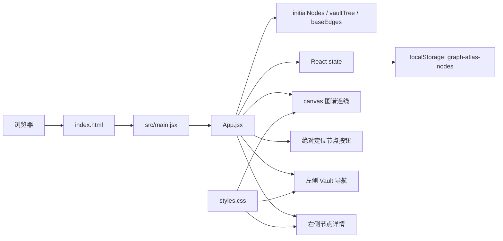
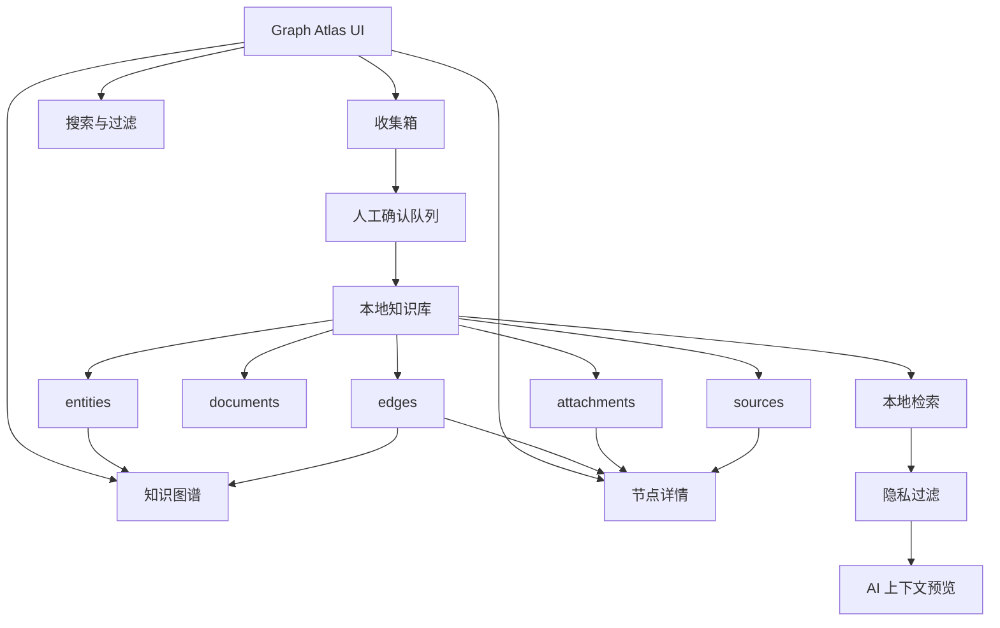
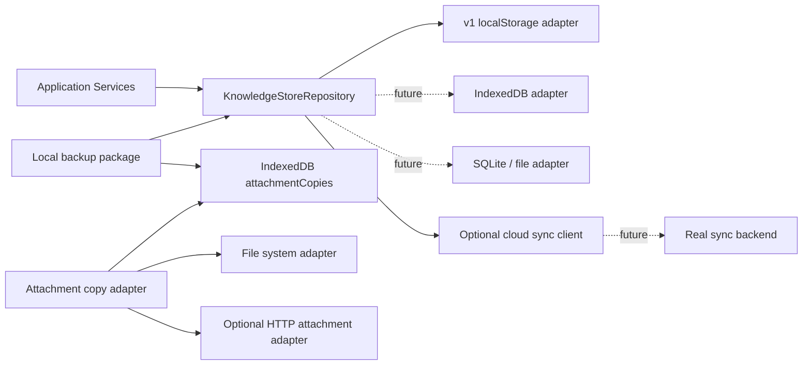

# Graph Atlas 系统架构

本文档负责定义当前架构、目标架构、核心数据模型、架构原则和高层迁移方向。本文档不负责详细迁移算法、工程目录约束或测试策略；迁移细节见 `DATA_MIGRATION_PLAN.md`，工程约束见 `ENGINEERING_GUIDE.md`，测试策略见 `TEST_STRATEGY.md`。

## 1. 架构目标

Graph Atlas 要从静态图谱 UI 升级为本地隐私优先的个人知识库底座。第一阶段重点不是 AI，而是稳定的数据模型、关系一致性、来源证据和本地持久化。

## 2. 当前原型架构



当前问题：

- 数据集中在 `App.jsx`。
- `links` 使用标题匹配，`baseEdges` 使用 ID，关系容易漂移。
- localStorage 读取没有异常处理。
- 隐私级别只是展示字段。
- 来源证据尚未成为数据模型的一等对象。

## 3. 目标架构



## 4. 目标分层架构

第一阶段目标架构应按职责分层，而不是只按文件拆分。核心原则是：UI 只触发用例，应用服务承载业务流程，领域层负责规则，仓储层隔离存储实现，隐私和证据作为贯穿策略。

```text
UI Layer
  Graph View / Detail Panel / Inbox / Search

View Model / Selectors
  graph view model
  detail panel view model
  home task summary
  material status summary

Application Services
  addEntity
  updateEntity
  createEdge
  searchKnowledge
  buildAiContext
  confirmInboxItem
  migrateStore

Domain Layer
  entities
  edges
  documents
  attachments
  sources
  privacy rules
  relationship derivation
  validation

Repository Layer
  KnowledgeStoreRepository
  localStorage adapter for v1
  future IndexedDB / SQLite / backend adapter

Cross-cutting Policies
  privacy filter
  source evidence
  audit events
  error recovery
```

### UI Layer

UI 层负责展示状态、接收用户输入和触发应用服务。UI 不直接读写 localStorage，不直接修改领域数据，也不直接拼接关系或组装复杂业务展示数据。

硬边界：

- UI 只能调用 Application Services。
- UI 只能消费 View Model / Selectors 输出的展示数据，或消费服务层返回的简单操作结果。
- UI 不拥有关系真相，不从标题、标签或展示文本推断关系。
- UI 不直接构建 AI 上下文。

### View Model / Selectors

View Model / Selectors 层负责把 domain store 转换成 UI 可直接消费的数据形状。它只做读取和派生，不读写 repository，不修改 domain store，也不承载业务写流程。

第一阶段 selector 边界：

- `graphSelectors`：派生图谱节点、连线、选中态和可视状态。
- `detailSelectors`：派生详情页基本信息、关系列表、附件、来源和资料状态。
- `homeSelectors`：派生首页任务摘要、出行检查摘要和资料状态摘要。

硬边界：

- 图谱、详情、首页摘要都通过 selector / view model 派生。
- selector 可以调用 domain 纯函数，但不能调用 repository。
- selector 不执行新增、更新、迁移、保存或 AI 上下文构建。
- Application Services 负责用例流程，Selectors 负责展示数据形状。

### Application Services

应用服务层负责承载用户用例和业务流程，例如新增资料、更新节点、建立关系、搜索、构建 AI 上下文、确认收集箱条目和执行迁移。所有写操作应通过应用服务进入领域层和仓储层。

第一阶段服务边界：

- `knowledgeService`：新增、更新、读取实体和详情。
- `relationshipService`：创建关系、派生详情关系、验证 edge 引用。
- `searchService`：本地搜索、隐私过滤输入。
- `inboxService`：待整理资料确认入库。
- `aiContextService`：只构建可见性预览，不调用模型。
- `migrationService`：执行 v0 到 v1 数据迁移。

### Domain Layer

领域层负责纯规则和数据派生，包括隐私默认值、关系派生、搜索匹配、数据校验、来源证据规则和 AI 上下文过滤输入。领域层不关心数据最终存在哪里。

硬边界：

- 关系只从 `edges` 派生。
- 隐私规则只使用 `privacyLevel` 和 `aiAccess` 等结构化字段。
- 重要资料必须有 `sourceIds` 或手动创建标记。
- 领域函数保持纯逻辑，不访问浏览器 API。

### Repository Layer

仓储层通过 `KnowledgeStoreRepository` 隔离存储实现。第一阶段实现 localStorage adapter，未来可替换为 IndexedDB、SQLite、文件系统或后端同步 adapter，而不重写 UI 和应用服务。

仓储接口必须至少表达以下能力：

- `loadStore()`：读取完整知识库对象。
- `saveStore(store)`：保存完整知识库对象。
- `resetToSeed()`：恢复 seed store。
- `migrateIfNeeded(rawData)`：兼容旧数据。
- `validateStore(store)`：保存前或读取后校验基本一致性。

### Attachment Copy Storage

附件索引属于 knowledge store 的 `attachments` 数据；附件二进制副本不应直接塞进主知识库 JSON。当前浏览器阶段通过附件存储适配器保存副本：

- 默认使用 IndexedDB database `graph-atlas-attachments` 和 object store `attachmentCopies`。
- IndexedDB 写入成功时，`attachments.localCopy` 只保存 manifest，使用 `contentEncoding: "indexeddb"` 和 `storageKey` 指向对象仓库记录。
- IndexedDB 不可用或写入失败时，小文件回退 inline base64；超限文件只保留索引、本地引用和 `copyStatus: "skipped-too-large"`，并在收集箱、详情页和设置页提示需要外部存储。
- 用户在设置页选择本地附件目录后，超出 IndexedDB 上限的新文件可通过 File System Access adapter 保存到本机目录；manifest 使用 `contentEncoding: "file-system"` 和 `copyStatus: "stored-file-system"`。
- 用户在设置页配置 HTTP 上传 endpoint 后，超出 IndexedDB 上限的新文件可通过 remote adapter 保存到可选后端；manifest 使用 `contentEncoding: "remote"` 和 `copyStatus: "stored-remote"`。当前项目只提供客户端契约和 mock 回归，不内置真实后端服务。
- 历史 `copyStatus: "skipped-too-large"` 附件可由用户在设置页主动触发补拷贝，优先写入本地附件目录，或在配置 endpoint 后写入 remote adapter；补拷贝失败不破坏原有索引和本地引用。
- 本地备份包会把 knowledge store 与 IndexedDB 附件副本一起导出；用户可选择明文 JSON 或密码加密 JSON。恢复时先恢复附件副本，成功后再覆盖主知识库。
- 加密备份使用浏览器 Web Crypto 对完整备份包做本地文件加密，密码不进入 localStorage、knowledge store 或备份明文字段，也不提供找回。
- 本地备份包不自动打包本地附件目录中的外部文件副本，只保留 knowledge store 中的附件 manifest。
- 附件存储 adapter 契约统一表达 `store`、`read`、`remove` 和 `getCapabilities`；设置页通过能力诊断显示 IndexedDB、备份包、inline fallback、文件系统和后端同步状态。
- 当前阶段不引入真实后端服务、账号体系或跨设备合并同步；remote adapter 仅是可配置客户端契约。
- 进入真实跨设备同步阶段时，再独立设计后端鉴权、冲突合并、云端密钥管理和服务端存储策略。

### Cross-cutting Policies

隐私过滤、来源证据、审计事件和错误恢复是贯穿能力，不应散落在单个组件里。第一阶段至少要在数据结构中预留 `auditLog` 或 `events`，即使暂不实现完整审计 UI。

贯穿策略必须影响以下路径：

- 读取：高隐私资料可以本地展示，但必须带明确状态。
- 搜索：搜索结果可以显示本地资料，但 AI 预留上下文必须再过滤。
- AI 上下文：只能通过 `aiContextService` 和 privacy filter 构建。
- 导出：未来导出必须经过隐私策略确认。
- 错误恢复：迁移失败、JSON 损坏、引用缺失都必须可恢复。

## 5. 核心数据模型

第一阶段统一为：

- `entities`：图谱实体节点。
- `edges`：实体之间的 ID-based 关系。
- `documents`：原始资料记录或资料索引。
- `attachments`：附件索引。
- `sources`：来源证据，可指向 `entity`、`document` 或 `edge`。
- `auditLog`：审计事件预留，第一阶段可为空数组。

### Entity

```js
{
  id: "passport",
  title: "护照",
  type: "document_id",
  icon: "PAS",
  color: "#9d6bff",
  x: 50,
  y: 47,
  privacyLevel: "high",
  aiAccess: false,
  tags: ["证件", "护照", "出境"],
  summary: "护照资料与出境相关材料索引",
  createdAt: "2023-01-15",
  updatedAt: "2026-06-18T00:00:00.000Z",
  favorite: true,
  sourceIds: ["source-passport-main"]
}
```

### Edge

```js
{
  id: "edge-passport-profile",
  fromId: "passport",
  toId: "profile",
  relationType: "belongs_to",
  label: "属于",
  privacyLevel: "high",
  sourceId: "source-passport-main",
  confidence: 1,
  createdAt: "2026-06-18T00:00:00.000Z"
}
```

### Document / Attachment / Source

```js
{
  documents: [
    {
      id: "doc-passport",
      title: "护照信息",
      fileType: "note",
      privacyLevel: "high",
      aiAccess: false
    }
  ],
  attachments: [
    {
      id: "att-passport-cover",
      documentId: "doc-passport",
      name: "护照首页.jpg",
      mimeType: "image/jpeg",
      size: "1.2 MB"
    }
  ],
  sources: [
    {
      id: "source-passport-main",
      targetType: "entity",
      targetId: "passport",
      kind: "manual",
      label: "手动创建"
    },
    {
      id: "source-edge-passport-profile-seed",
      targetType: "edge",
      targetId: "edge-passport-属于-profile",
      kind: "seed",
      label: "示例关系来源"
    }
  ]
}
```

关系事实仍以 `edges` 为准。关系来源对象只记录“这条关系为什么存在”：手动创建关系和 AI 建议确认关系会写入 `sources.targetType = "edge"`；seed 关系可由视图模型派生只读来源对象，避免把示例库膨胀成大量重复来源记录。

## 6. 枚举

知识域：

- `identity`
- `work`
- `files`
- `people`
- `life`
- `projects`
- `accounts`

节点类型：

- `document_id`
- `person`
- `file`
- `project`
- `account`
- `event`
- `note`
- `task`

关系类型：

- `belongs_to`
- `related_to`
- `contains`
- `proves`
- `uses`
- `reminds`
- `archived_in`
- `contact_for`
- `depends_on`

隐私等级：

- `high`
- `medium`
- `low`

## 7. 能力边界

### AI Suggestion

AI Suggestion 是未来的整理建议能力，用于建议新增节点、标签、摘要或关系。第一阶段只预留确认队列和引用依据，不进行真实模型调用。

### AI Retrieval

AI Retrieval 是未来的引用式检索能力，用于基于允许访问的资料返回证据片段和关系路径。第一阶段只预留 AI 上下文构建和隐私过滤，不引入向量库。

### Storage Adapter

第一阶段只实现 localStorage adapter。任何代码都不应假设存储永远是 localStorage，而应通过 Repository 抽象访问。

## 8. 迁移策略

本节只保留高层迁移方向。数据版本、localStorage key、读取顺序、失败回退和校验规则以 `DATA_MIGRATION_PLAN.md` 为唯一事实来源。

- 当前 `initialNodes` 每一项迁移为 `Entity`。
- 当前 `baseEdges` 迁移为 `Edge`。
- 当前 `links` 不再作为关系数据源，只作为迁移校验参考。
- 当前 `attachments` 迁移为 `Attachment`。
- 当前 `preview` 先迁移为 `Document` 正文或摘要。
- 图谱和详情面板都从 `edges` 读取关系。
- 目标 store 预留 `auditLog` 或 `events`，第一阶段可以为空。

## 9. 数据一致性规则

- 所有实体 ID 必须唯一。
- 所有边的 `fromId` 和 `toId` 必须存在于 `entities`。
- 所有关系显示均来自 `edges`。
- 所有重要节点至少有一个 `sourceId` 或明确标记为手动创建。
- 标题可以修改，但关系不能依赖标题。
- 删除实体前必须处理关联边。

## 10. 架构原则

- 本地优先：第一阶段继续前端本地持久化。
- 证据优先：重要信息必须能追溯来源。
- 关系唯一：关系只从 `edges` 派生。
- 隐私前置：隐私级别影响读取、展示、搜索、AI 上下文和未来导出。
- AI 后置：先打好知识库地基，再接 AI/RAG。
- 存储可替换：业务逻辑依赖 Repository 抽象，不绑定 localStorage。
- 服务承载用例：新增、编辑、搜索、迁移、AI 上下文构建等业务流程必须进入 Application Services。
- UI 保持轻薄：组件负责体验和状态呈现，不承载知识库业务规则。
- 展示派生集中：图谱、详情、首页摘要和资料状态摘要都通过 selector / view model 派生。

## 11. 未来存储演进路径

第一阶段只实现 localStorage adapter，但架构上按可替换仓储设计：



演进原则：

- v1 不内置后端服务；可选 HTTP attachment adapter 只在用户配置 endpoint 后启用。
- v1 不引入数据库。
- 附件副本当前使用浏览器 IndexedDB、inline fallback、用户授权的本地附件目录和可选 HTTP 上传 endpoint；adapter 已具备读、删、能力诊断和历史大文件补拷贝契约。
- 云同步当前只提供可选 HTTP 客户端契约、设置页连接诊断、手动推送本地 knowledge store 快照和远端快照差异预览；远端只有 summary 时仅显示数量差异，远端包含完整 store 时可显示新增、缺失和可能冲突；不会自动上传、自动拉取、自动覆盖或合并。
- 本地备份包支持明文导出和密码加密导出，但仍是本地文件导出/覆盖恢复能力，不等同于云同步、账号恢复或跨设备合并。
- 业务逻辑不得依赖 localStorage key。
- 未来接入真实同步后端、账号体系、冲突合并和云端密钥管理时，不重写 UI 和领域规则。
