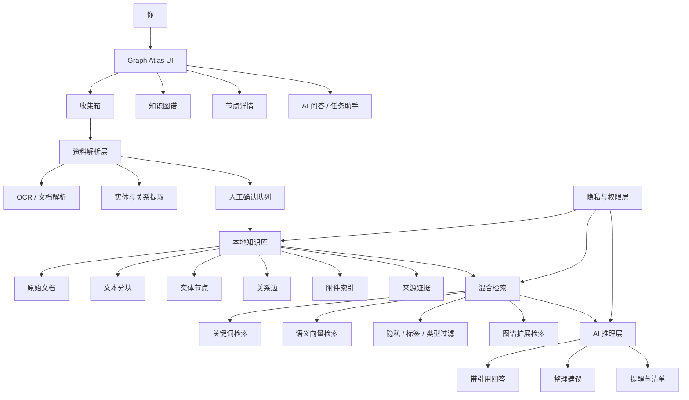
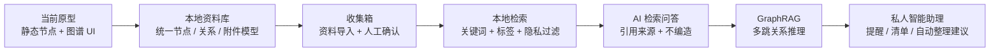

# Graph Atlas 个人知识库架构说明

## 1. 项目定位

Graph Atlas 应定位为你的个人知识操作台，而不是单纯的笔记软件或文件管理器。

它的核心目标是把分散在证件、文件、联系人、项目、合同、旅行、账号和生活记录中的个人信息，组织成一个本地优先、关系驱动、可被 AI 安全辅助的个人知识系统。

当前 UI 已经具备很好的雏形：

- 左侧 Vault 树适合作为知识域导航。
- 中央图谱适合作为个人记忆地图。
- 右侧节点详情适合作为实体档案。
- 附件、标签、隐私级别和关系说明适合作为 AI 知识库的基础字段。

下一阶段不应只继续增加视觉节点，而应把底层升级为“资料摄取 + 本地知识库 + 图谱关系 + 混合检索 + 可溯源 AI”的架构。

## 2. 总体架构图



这套架构的关键不是“AI 能不能回答”，而是 AI 回答前能否检索到正确资料、是否有权限访问、能否给出来源、能否避免编造。

## 3. 产品规划图



建议按这条路线推进：

1. 先把当前原型变成可靠的数据系统。
2. 再做资料进入系统的收集箱。
3. 然后做本地检索和隐私过滤。
4. 最后逐步加入 AI 问答、GraphRAG 和私人助理能力。

## 4. 核心数据模型

当前 `nodes` 数组应逐步拆成更稳定的知识库模型。

```mermaid
erDiagram
  DOCUMENT ||--o{ CHUNK : contains
  DOCUMENT ||--o{ ATTACHMENT : has
  DOCUMENT ||--o{ SOURCE : cites

  ENTITY ||--o{ EDGE : from
  ENTITY ||--o{ EDGE : to
  ENTITY ||--o{ SOURCE : supported_by

  CHUNK ||--o{ SOURCE : evidence_for
  CHUNK ||--o{ EMBEDDING : indexed_as

  ENTITY {
    string id
    string title
    string type
    string privacyLevel
    string[] tags
    string summary
  }

  EDGE {
    string id
    string fromId
    string toId
    string relationType
    string sourceId
    number confidence
  }

  DOCUMENT {
    string id
    string title
    string fileType
    string privacyLevel
    string createdAt
    string updatedAt
  }

  CHUNK {
    string id
    string documentId
    string text
    number order
  }

  ATTACHMENT {
    string id
    string documentId
    string name
    string mimeType
    string storagePath
  }

  SOURCE {
    string id
    string documentId
    string chunkId
    string quote
    string location
  }

  EMBEDDING {
    string id
    string chunkId
    string model
    string vectorRef
  }
```

### 模型解释

- `DOCUMENT`：原始资料，例如 PDF、图片、网页、聊天记录、合同、证件扫描件。
- `CHUNK`：文档切分后的文本片段，用于检索和引用。
- `ENTITY`：图谱节点，例如护照、身份证、联系人、项目、合同、旅行计划。
- `EDGE`：实体之间的关系，例如“属于”“关联证件”“用于登录”“相关证明”。
- `ATTACHMENT`：附件索引，记录文件名、类型和存储位置。
- `SOURCE`：证据来源，保证 AI 回答和关系推断可以追溯。
- `EMBEDDING`：语义检索索引，默认不应包含高隐私资料，除非你明确允许。

核心原则：节点不是全部，来源证据才是可信基础。

## 5. 分阶段建设路线

### 第一阶段：打地基

目标：把当前 UI 原型变成结构可靠的本地知识库。

- 将 `nodes` 拆成 `entities` 和 `edges`。
- 所有关系改为 ID-based，不再通过标题匹配。
- 新增 `documents`、`attachments`、`sources` 的最小结构。
- 修复 `localStorage` 异常读取问题，避免损坏数据导致页面崩溃。
- 将种子数据从 `App.jsx` 移到独立数据层。

### 第二阶段：建设收集箱

目标：让资料可以进入系统，并在入库前经过确认。

- 新增收集箱视图。
- 支持手动新增资料和附件索引。
- 新资料默认进入“待整理”状态。
- AI 可以建议节点、标签和关系，但必须由你确认后入库。
- 每一次确认都保留来源、时间和修改记录。

### 第三阶段：本地检索与隐私控制

目标：先实现可靠查找，再接入更复杂 AI。

- 搜索范围覆盖标题、正文、标签、类型、关系、附件和来源。
- 支持按隐私级别、节点类型、标签、时间过滤。
- 高隐私资料默认只允许本地浏览，不进入 AI 上下文。
- 增加“AI 可访问”开关。
- 增加简单审计记录：哪些资料被检索、哪些资料被 AI 使用。

### 第四阶段：AI 检索问答

目标：让 AI 成为有证据的资料助手，而不是自由发挥的聊天机器人。

- AI 回答必须带引用来源。
- 无证据时明确提示“知识库中没有可靠依据”。
- 回答中展示相关节点路径和证据片段。
- 支持典型问题：
  - “我出国前需要准备哪些资料？”
  - “我的护照相关文件在哪里？”
  - “哪些证件快过期了？”
  - “某个项目涉及哪些合同、人和文件？”

### 第五阶段：GraphRAG 与私人顾问能力

目标：让图谱真正参与推理和行动建议。

- 问题不只查单个文档，还沿图谱扩展上下文。
- 例如从“护照”扩展到“签证记录、旅行清单、紧急联系人、文件资料”。
- 增加“关系解释”：为什么系统认为两个节点有关。
- 增加提醒能力：证件过期、合同续签、项目跟进、资料缺失。
- 最终形成私人记忆系统和决策辅助系统。

## 6. 架构原则

### 本地隐私优先

个人知识库会包含证件、账号、联系人、合同等高度敏感资料。默认策略应是本地存储、本地检索、本地可控，云端 AI 只能访问明确允许的低敏资料。

### 证据优先

AI 回答必须能追溯到资料来源。不能只有结论，必须有文档、片段、关系路径或人工确认记录作为依据。

### AI 只建议，不擅自改库

AI 可以建议新增节点、修改标签、建立关系、生成摘要，但不应自动改变你的知识库。关键变更必须进入人工确认队列。

### 图谱参与推理

图谱不应只是视觉效果。关系边应参与检索、上下文扩展和多跳推理，帮助 AI 理解“这个资料和哪些人、文件、项目、事件有关”。

### 原始资料长期保留

不要只保存 AI 摘要或整理后的结论。原始文件、原始片段、附件索引和来源证据必须保留，否则未来无法验证或重新分析。

## 7. MVP 验收标准

第一版可落地 MVP 应满足：

- 可以新增一个资料节点，并建立至少一条 ID-based 关系。
- 可以从节点跳到来源文件或附件记录。
- 可以搜索出相关节点、附件和关系。
- 可以按隐私级别过滤内容。
- 图谱和详情面板显示的关系完全一致。
- AI 问答只基于允许访问的资料，并返回引用。
- 无证据时不编造答案。

## 8. 给你的私人建议

我建议你不要把这个项目做成“又一个笔记软件”。它更适合成为你的私人资料中枢：

- 证件、合同、联系人、项目、旅行、资产和重要账号应该优先纳入。
- 每条重要信息都应有来源和更新时间。
- 高隐私资料默认不交给云端 AI。
- 先做可靠的资料整理和检索，再做自动化。
- 图谱关系是这个产品的差异点，应尽早进入底层模型，而不是停留在 UI。

最推荐的近期路线：

1. 统一实体和关系数据模型。
2. 做本地收集箱。
3. 做隐私过滤和来源证据。
4. 做带引用的 AI 问答。
5. 做 GraphRAG 和提醒能力。

## 9. 与当前项目文档的关系

- `PROJECT_KNOWLEDGE_GRAPH.md`：描述当前项目是什么、代码和数据如何组织。
- `PERSONAL_KNOWLEDGE_BASE_ARCHITECTURE.md`：描述未来应该怎么搭建、为什么这样搭建、分阶段怎么推进。
- `PRODUCT_SPEC.md`：定义第一版产品目标、核心场景、MVP 范围和成功标准。
- `DATA_MODEL_SPEC.md`：定义实体、关系、文档、附件和来源证据的数据结构。
- `PRIVACY_MODEL.md`：定义隐私等级、AI 访问策略、威胁模型和安全默认值。
- `MVP_ROADMAP.md`：定义阶段拆分、验收标准和开发优先级。
- `DEVELOPMENT_BACKLOG.md`：定义可直接进入开发拆解的任务清单。
- `USER_JOURNEY.md`：定义新增资料、查找护照文件、准备出行清单、建立联系人关系和确认 AI 建议等核心任务流。
- `INFORMATION_ARCHITECTURE.md`：定义知识域、节点类型、关系类型、标签规则和详情页信息层级。
- `MVP_PRD.md`：定义第一版可开发需求、用户故事、交互状态和验收标准。
- `UX_FLOW_SPEC.md`：定义搜索、新增资料、关系创建、隐私切换、收集箱、重置和详情页状态。
- `AI_TRUST_AND_RETRIEVAL_SPEC.md`：定义 AI 可访问范围、检索结果结构、引用规则和无证据状态。
- `METRICS_SPEC.md`：定义北极星指标、MVP 核心指标、质量指标和验收阈值。
- `RELEASE_CHECKLIST.md`：定义第一版发布前的数据、关系、隐私、搜索、资料新增和文档检查项。
- `COMPETITIVE_REFERENCE.md`：定义 Obsidian、Notion、Mem、NotebookLM、Rewind/Limitless 和 Apple Notes 的参照差异。

这些文档应一起维护：项目知识图谱服务于当前工程理解，本架构说明服务于总体方向，其余规格文档服务于开发前决策和阶段执行。
